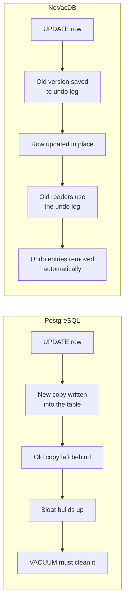
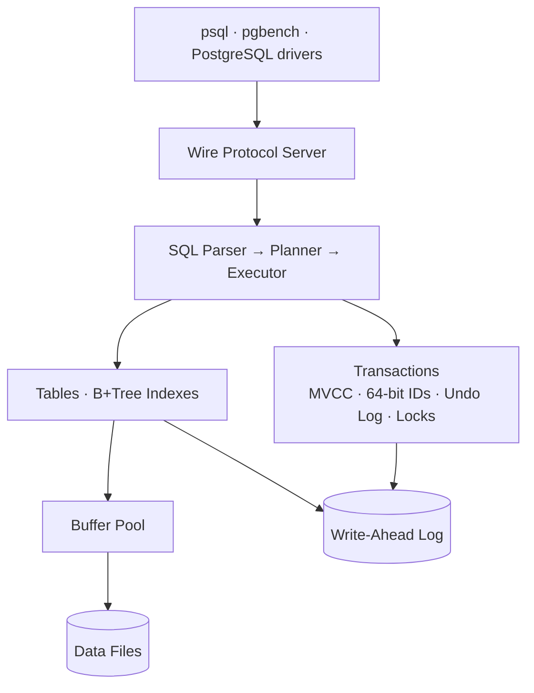

<div align="center">

# NoVacDB

**A PostgreSQL-compatible database, built from scratch in Go — with no VACUUM, no bloat, and no wraparound.**


[Why NoVacDB](#why-novacdb) •
[How it works](#how-it-works) •
[Roadmap](#roadmap) •
[Getting started](#getting-started) •
[Contributing](#contributing)

</div>

---

> ⚠️ **NoVacDB is in early development.** It is not ready for production data. Follow the [roadmap](#roadmap) to see what works today.

## What is NoVacDB?

NoVacDB is a relational database written from scratch in Go. It speaks the **PostgreSQL wire protocol**, so you can connect to it with `psql`, benchmark it with `pgbench`, and use it from standard PostgreSQL drivers — no special client needed.

The goal is simple: **keep what developers love about PostgreSQL, and fix the problems they fight with every day — in the design itself, not with extra tools and tuning.**

## Why NoVacDB?

PostgreSQL never updates a row in place. Every `UPDATE` writes a brand-new copy of the row and leaves the old one behind. Over time this causes:

- **Table and index bloat** — dead rows pile up and tables grow far beyond their real size
- **VACUUM** — a background cleanup process that eats CPU and I/O, and is notoriously hard to tune
- **Transaction ID wraparound** — 32-bit transaction IDs can run out, forcing emergency maintenance
- **Heavy connections** — one OS process per connection, so you need an external pooler like PgBouncer
- **Locking schema changes** — some `ALTER TABLE` operations block your app while they run

NoVacDB is designed so these problems don't exist in the first place.

| | PostgreSQL | NoVacDB |
|---|---|---|
| Old row versions | Stored in the table | Stored in a separate undo log |
| Cleanup | VACUUM required | Automatic, no VACUUM |
| Table bloat | Yes | No |
| Transaction IDs | 32-bit (wraparound risk) | 64-bit (no wraparound) |
| Connections | One OS process each | Lightweight goroutine each |
| Connection pooler | PgBouncer usually needed | Not needed |
| Wire protocol | PostgreSQL | PostgreSQL |

*Rows in this table describe NoVacDB's design goals. Each one is marked as done in the [problem checklist](WORKFLOW.md#4-postgresql-problems-we-are-fixing) only once it is implemented and proven by tests or benchmarks.*

## How it works

The core idea: **update rows in place, and keep old versions in an undo log that cleans itself.**



### Architecture at a glance



Every change is written to the **Write-Ahead Log (WAL)** before it reaches the data files, so a crash at any moment never loses committed data.

A full walkthrough of every component, the query lifecycle, and crash recovery is in **[WORKFLOW.md](WORKFLOW.md)**.

### Design principles

- **Correctness first** — a feature isn't done until crash tests pass
- **Zero dependencies in the core** — storage, WAL, indexes, SQL, and transactions use only the Go standard library
- **PostgreSQL-compatible by default** — we only behave differently where PostgreSQL has a known problem
- **Measure, don't guess** — every performance claim comes with a benchmark

## Roadmap

| Phase | Component | Status |
|---|---|---|
| 1 | Storage: pages, disk manager, buffer pool | ✅ Done |
| 2 | Write-ahead log and crash recovery | ✅ Done |
| 3 | B+Tree indexes | ✅ Done |
| 4 | SQL parser and executor | ✅ Done |
| 5 | PostgreSQL wire protocol — **MVP: `psql` can connect** | ✅ Done |
| 6 | Transactions and MVCC with undo log — **no VACUUM** | 📋 Planned |
| 7 | Query planner, joins, aggregates | 📋 Planned |
| 8 | Query insights and benchmarks vs PostgreSQL | 📋 Planned |
| 9 | ORM compatibility (Prisma, TypeORM, Drizzle) | 📋 Planned |
| 10 | Online schema changes, backups, upgrades | 📋 Planned |
| 11 | Change streams, audit log, row history | 📋 Planned |

Legend: ✅ Done · 🚧 In progress · 📋 Planned

The full list of 50 PostgreSQL problems NoVacDB tracks, and which phase fixes each one, is in the [problem checklist](WORKFLOW.md#4-postgresql-problems-we-are-fixing).

### Not goals (for now)

Distributed clustering and sharding, full-text search, vector search, time-series workloads, and replacing PostgreSQL in production.

## Getting started

> The MVP is complete: `psql`, `pgbench` and standard drivers connect, and data survives crashes. There are no transactions yet (`BEGIN` is an error and every statement commits on its own), no joins or aggregates, and only six types (`integer`, `bigint`, `double precision`, `text`, `boolean`, `timestamptz`): those come in Phases 6 and 7.

### Prerequisites

- Go (latest stable release)
- `make`
- PostgreSQL client tools (`psql`, `pgbench`) for testing

### Build and run

```bash
git clone https://github.com/<your-username>/NoVacDB.git
cd NoVacDB

make build
./bin/novacdb --data-dir ./data --port 5433
```

### Connect

```bash
psql -h localhost -p 5433
```

```sql
CREATE TABLE users (id INT PRIMARY KEY, name TEXT);
INSERT INTO users VALUES (1, 'Asha'), (2, 'Ravi');
SELECT * FROM users WHERE id = 1;
```

NoVacDB runs on port **5433** by default, so it won't clash with a local PostgreSQL on 5432. It listens on `localhost` only by default, because authentication is trust: anyone who can reach the port can connect.

Other options: `--listen` (address, empty for every interface), `--max-connections` (default 1000), `--idle-timeout` (end idle sessions, off by default) and `--shutdown-timeout` (on SIGINT or SIGTERM, how long running statements may take to finish before the database closes; default 30s, and a second signal stops at once).

### Use it from your app

Because NoVacDB speaks the PostgreSQL protocol, a standard driver just works:

```js
import pg from "pg";

const client = new pg.Client({ host: "localhost", port: 5433 });
await client.connect();
const { rows } = await client.query("SELECT * FROM users WHERE id = $1", [1]);
```

## Testing

Losing data is the worst thing a database can do, so testing is the biggest part of this project.

| Command | What it checks |
|---|---|
| `make test` | Unit tests with the race detector |
| `make sqltest` | SQL logic tests — are query results correct? |
| `make crashtest` | Kills the server at random moments — is committed data always safe? |
| `make fuzz` | Random inputs to the parser, page decoder, and WAL reader |
| `make bench` | Benchmarks, including comparisons with PostgreSQL |

Details are in the [testing strategy](WORKFLOW.md#5-testing-strategy).

## Project structure

```
NoVacDB/
├── cmd/novacdb/      # Server entry point
├── internal/
│   ├── storage/      # Pages, disk manager, buffer pool
│   ├── wal/          # Write-ahead log and recovery
│   ├── btree/        # B+Tree indexes
│   ├── catalog/      # Table, column, and index metadata
│   ├── sql/          # Parser, planner, executor
│   ├── txn/          # Transactions, MVCC, undo log, locks
│   └── server/       # PostgreSQL wire protocol
├── tests/            # SQL logic tests and crash tests
├── bench/            # Benchmarks and results
└── docs/design/      # One design doc per component
```

## Contributing

Contributions, questions, and ideas are welcome.

1. Look for issues labelled `good first issue`, or open a new one
2. For anything bigger than a small fix, discuss the approach in the issue first
3. Every change needs tests; changes to storage, WAL, or transactions also need crash tests
4. Run `make test` and `make lint` before opening a pull request

The full development workflow, pull request checklist, and code style are in **[WORKFLOW.md](WORKFLOW.md#6-build-run--contribute)**.

## Learn more

- [WORKFLOW.md](WORKFLOW.md) — architecture, development workflow, problem checklist, testing strategy
- [docs/design/](docs/design/) — design doc for each component

## License

License to be decided. Until a license file is added, all rights are reserved by the author.
