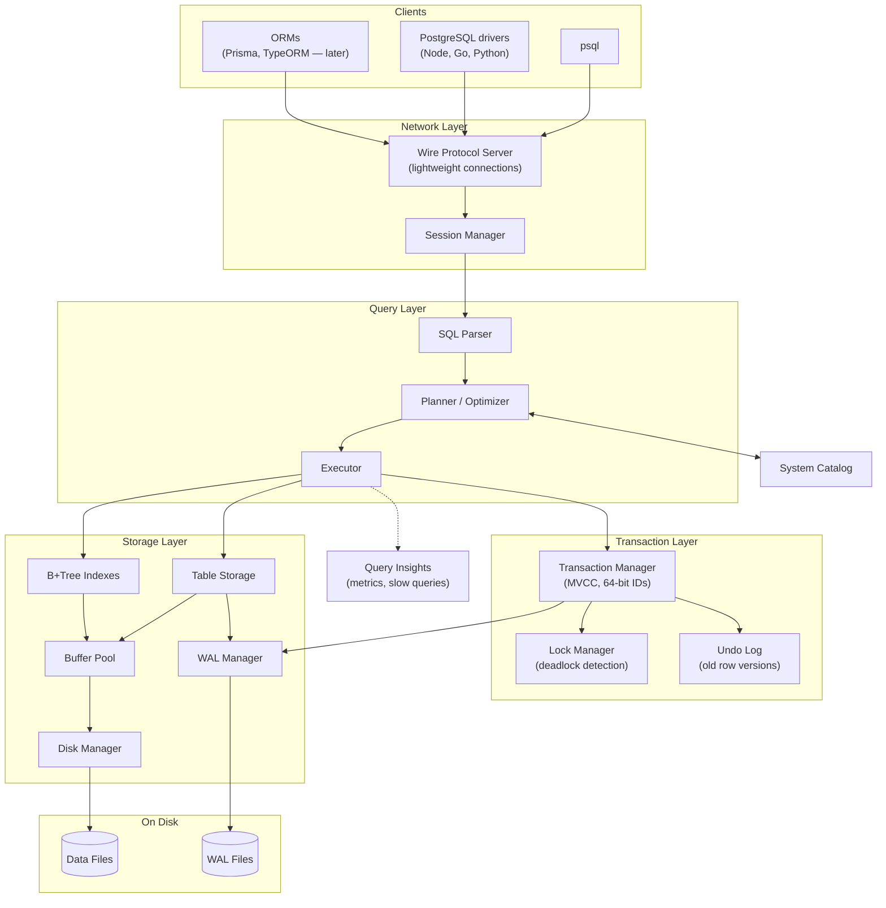
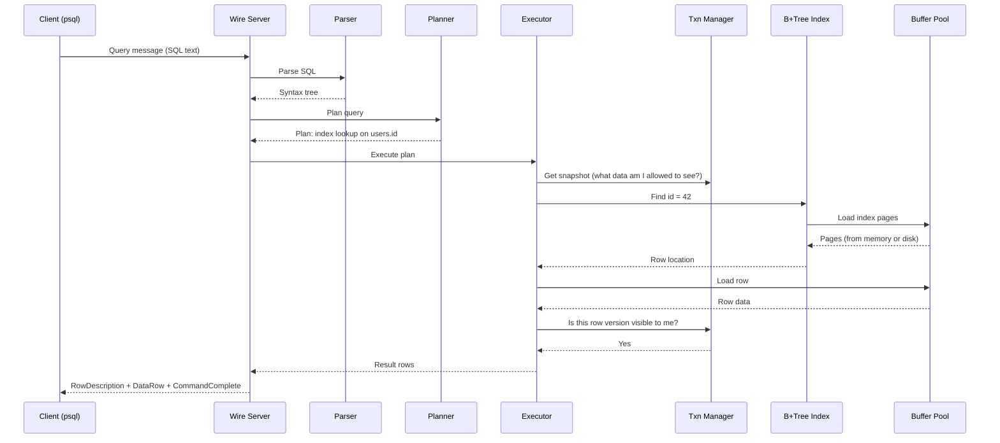
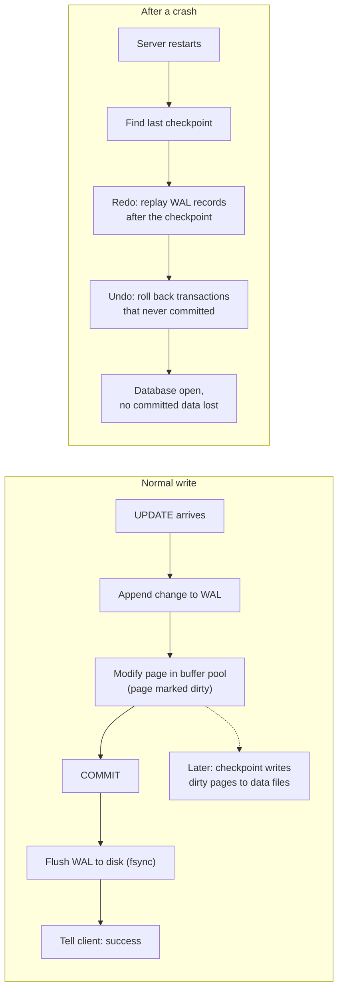
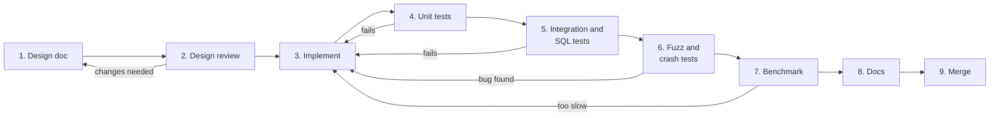
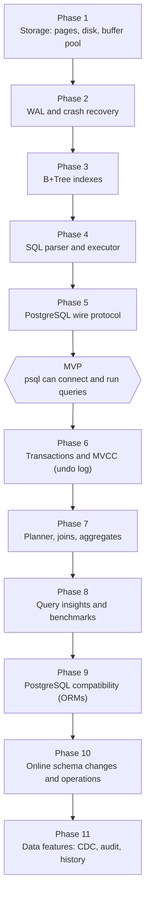
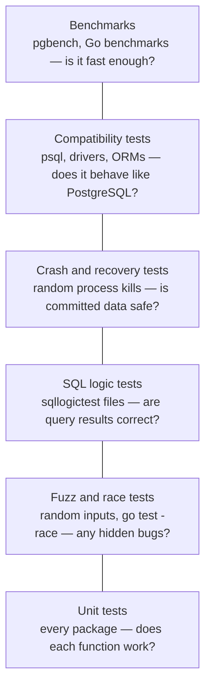
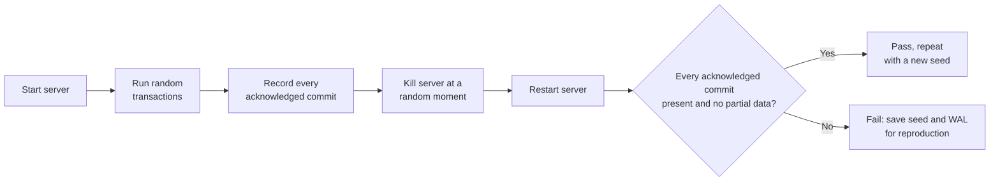
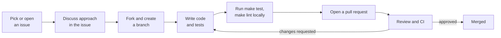

# NoVacDB — Development Workflow

This document explains what NoVacDB is, how it is designed, how each part of it gets built and tested, and which PostgreSQL problems it sets out to fix. It is written so that anyone — a new contributor, a reviewer, or someone just curious — can read it top to bottom and understand the project.

---

## Table of Contents

1. [Project Introduction](#1-project-introduction)
2. [Diagrams](#2-diagrams)
3. [Development Workflow](#3-development-workflow)
4. [PostgreSQL Problems We Are Fixing](#4-postgresql-problems-we-are-fixing)
5. [Testing Strategy](#5-testing-strategy)
6. [Build, Run & Contribute](#6-build-run--contribute)

---

## 1. Project Introduction

### What is NoVacDB?

NoVacDB is a relational database written from scratch in **Go**. It speaks the **PostgreSQL wire protocol**, which means existing tools like `psql`, `pgbench`, and standard PostgreSQL drivers can connect to it without any changes.

### Why build it?

PostgreSQL is one of the best databases ever made, but after 30+ years it carries design decisions that cause real pain in production: table bloat, VACUUM tuning, transaction ID wraparound, heavy per-connection processes, and schema changes that lock tables.

NoVacDB asks a simple question: **what if these problems were solved in the design itself, instead of with extra tools and tuning?**

### Goals

- Speak the PostgreSQL protocol so existing apps and tools work unchanged
- Fix PostgreSQL's known weaknesses at the design level (see [Section 4](#4-postgresql-problems-we-are-fixing))
- Never lose committed data — correctness comes before speed
- Keep the codebase readable, so it can also serve as a learning resource

### Non-goals (for now)

- Distributed clustering, sharding, or multi-node replication
- Replacing PostgreSQL in production
- Full-text search, vector search, and time-series workloads

### Design principles

| Principle | What it means in practice |
|---|---|
| **Correctness first** | A feature is not done until crash tests pass |
| **Zero dependencies in the core** | Storage, WAL, indexes, SQL, and transactions use only the Go standard library |
| **Compatible by default** | If PostgreSQL behaves a certain way and it is not a known problem, we behave the same way |
| **Measure, don't guess** | Every performance claim is backed by a benchmark |

---

## 2. Diagrams

### 2.1 Architecture

How the main components fit together, from the client at the top to the files on disk at the bottom.



**Reading the diagram:**

- **Network Layer** accepts client connections and speaks the PostgreSQL protocol. Each connection is a lightweight goroutine, not an OS process.
- **Query Layer** turns SQL text into a tree (parser), picks the fastest way to run it (planner), and runs it (executor).
- **Transaction Layer** makes sure concurrent users see consistent data and that transactions are all-or-nothing.
- **Storage Layer** reads and writes fixed-size pages, keeps hot pages in memory (buffer pool), and logs every change to the WAL before it touches disk.
- **System Catalog** stores metadata: which tables, columns, and indexes exist.

### 2.2 Life of a query

What happens when a client runs `SELECT * FROM users WHERE id = 42;`



### 2.3 Write path and crash recovery

The golden rule: **a change is written to the WAL before it is allowed to reach the data files.** This is what makes crash recovery possible.



### 2.4 How we avoid VACUUM

PostgreSQL keeps old row versions inside the table itself, so tables grow until VACUUM cleans them. NoVacDB keeps old versions in a separate undo log that cleans itself.

```mermaid
flowchart TB
    subgraph PG["PostgreSQL"]
        P1["UPDATE row"] --> P2["New row version written<br/>to a new spot in the table"]
        P2 --> P3["Old version stays in the table"]
        P3 --> P4["Table and indexes grow (bloat)"]
        P4 --> P5["VACUUM must scan and clean"]
    end

    subgraph PDB["NoVacDB"]
        D1["UPDATE row"] --> D2["Old version copied to undo log"]
        D2 --> D3["Row updated in place"]
        D3 --> D4["Readers who need the old version<br/>read it from the undo log"]
        D4 --> D5["Undo entries removed automatically<br/>once no reader needs them"]
    end
```



---

## 3. Development Workflow

Every component (buffer pool, WAL, B+Tree, parser, and so on) goes through the same steps before it is considered done.



### The steps

**1. Design doc.** Before writing code, write a short doc in `docs/design/` that answers: What problem does this component solve? What is the on-disk or in-memory format? What happens on failure or crash? What alternatives were considered and why were they rejected?

**2. Design review.** The design is reviewed before implementation starts. It is far cheaper to fix a design than to rewrite code.

**3. Implement.** Small, focused pull requests. One component or sub-feature at a time. Comments explain *why*, not just *what*.

**4. Unit tests.** Every public function is tested, including edge cases (empty input, full page, maximum key size).

**5. Integration and SQL tests.** The component is tested together with the rest of the system, using SQL test files.

**6. Fuzz and crash tests.** Random inputs to find hidden bugs, and random process kills to prove no committed data is lost.

**7. Benchmark.** Measure throughput and latency. Compare with PostgreSQL where it makes sense.

**8. Docs.** Update the README, the design doc, and the problem checklist in [Section 4](#4-postgresql-problems-we-are-fixing).

**9. Merge.** Only after CI is fully green.

### Definition of Done

A component is done only when all of these are true:

- [ ] Design doc exists and matches the code
- [ ] Unit tests pass, including with the race detector
- [ ] Related SQL logic tests pass
- [ ] Crash tests pass (where the component touches disk)
- [ ] Benchmarks recorded
- [ ] Docs and problem checklist updated

### Build order (phases)

Each phase builds on the one before it.



---

## 4. PostgreSQL Problems We Are Fixing

This is the full list of PostgreSQL weaknesses and day-to-day developer problems that NoVacDB tracks, grouped by the phase in which they are addressed.

### Status legend

| Status | Meaning |
|---|---|
| ✅ | Fixed — implemented, tested, and benchmarked |
| 🚧 | In progress |
| 📋 | Planned for the listed phase |
| 🔮 | Future — after the current roadmap |
| ❌ | Out of scope or won't fix (reason given) |

A problem is marked ✅ only when there is a test or benchmark that proves it.

### Phase 1 — Storage

| # | Problem | How NoVacDB addresses it | Status |
|---|---|---|---|
| 7 | Double buffering: data cached in both PostgreSQL's memory and the OS cache, wasting RAM | Own buffer pool with direct I/O | 📋 |

### Phase 2 — WAL and recovery

| # | Problem | How NoVacDB addresses it | Status |
|---|---|---|---|
| 8 | Large WAL volume from full-page writes after each checkpoint | Smaller, change-only WAL records with torn-page protection | 📋 |

### Phase 4 — SQL

| # | Problem | How NoVacDB addresses it | Status |
|---|---|---|---|
| 44 | Cryptic error messages | Clear errors that say what went wrong and suggest a fix | 📋 |
| 48 | `timestamp` vs `timestamptz` confusion leads to wrong times being saved | Timezone-safe default type | 📋 |

### Phase 5 — Connections

| # | Problem | How NoVacDB addresses it | Status |
|---|---|---|---|
| 12 | One OS process per connection, heavy on memory | Lightweight goroutine per connection | 📋 |
| 13 | Low practical `max_connections` | Thousands of connections without degradation | 📋 |
| 14 | External pooler (PgBouncer) needed, which breaks some session features | No external pooler needed | 📋 |

### Phase 6 — Transactions and MVCC

| # | Problem | How NoVacDB addresses it | Status |
|---|---|---|---|
| 1 | Table bloat from dead rows | Old versions live in the undo log, not the table | 📋 |
| 2 | VACUUM overhead and hard tuning | No VACUUM needed; undo log cleans itself | 📋 |
| 3 | Transaction ID wraparound (32-bit IDs) | 64-bit transaction IDs | 📋 |
| 4 | Write amplification: every UPDATE writes a new row and touches all indexes | In-place updates; indexes change only when indexed columns change | 📋 |
| 5 | HOT updates only work in limited cases | Not needed with in-place updates | 📋 |
| 6 | Index bloat, needing REINDEX | Indexes point to stable row locations | 📋 |
| 24 | Long-running transactions block cleanup | Undo retention bounded and monitored | 📋 |
| 43 | Deadlocks are hard to debug | Deadlock reports show exactly who was waiting on whom | 📋 |

### Phase 7 — Query planner

| # | Problem | How NoVacDB addresses it | Status |
|---|---|---|---|
| 27 | No query hints to force a plan | Built-in plan hints | 📋 |
| 28 | Plans suddenly change as data grows | Plan pinning for critical queries | 📋 |
| 29 | Bad estimates on correlated columns | Multi-column statistics by default | 📋 |
| 30 | `COUNT(*)` is slow on large tables | Fast count using maintained metadata | 📋 |
| 31 | `work_mem` is per operation, so complex queries can exhaust RAM | Per-query memory budget | 📋 |

### Phase 8 — Observability and defaults

| # | Problem | How NoVacDB addresses it | Status |
|---|---|---|---|
| 21 | Hundreds of settings; defaults not production-ready | Sensible defaults based on available hardware | 📋 |
| 26 | No built-in monitoring dashboard | Built-in metrics endpoint | 📋 |
| 32 | Understanding slow queries needs extensions and EXPLAIN expertise | Automatic slow-query capture with plain-language hints | 📋 |

### Phase 10 — Online schema changes and operations

| # | Problem | How NoVacDB addresses it | Status |
|---|---|---|---|
| 20 | Major version upgrades need downtime | Backward-compatible on-disk format with in-place upgrades | 📋 |
| 22 | Some `ALTER TABLE` operations lock or rewrite the whole table | Online schema changes without blocking writes | 📋 |
| 23 | `CREATE INDEX` blocks writes; the concurrent version can leave an invalid index | Online index builds that clean up on failure | 📋 |
| 25 | Proper backups need external tools | Built-in backup and point-in-time restore | 📋 |
| 42 | Running migrations in production is risky | Migration dry-run that reports locks and duration | 📋 |

### Phase 11 — Data features

| # | Problem | How NoVacDB addresses it | Status |
|---|---|---|---|
| 37 | Streaming changes (CDC) requires complex logical decoding | Simple built-in change stream | 📋 |
| 39 | LISTEN/NOTIFY doesn't scale and has a small payload limit | Scalable built-in notifications | 📋 |
| 40 | No built-in row history | Temporal tables: query any row as of a past time | 📋 |
| 41 | Audit logging needs an extension | Built-in audit log | 📋 |
| 47 | Finding and deleting all of a user's data (privacy laws like DPDP) is manual | Data ownership tags and one-command deletion | 📋 |

### Future

| # | Problem | Notes | Status |
|---|---|---|---|
| 9 | No compression for regular tables | Page-level compression | 🔮 |
| 33 | No query result cache | Optional result cache | 🔮 |
| 38 | Updating one JSONB field rewrites the whole value | Partial JSON updates | 🔮 |
| 45 | Row Level Security is complex and can slow queries | Simpler row-level security | 🔮 |
| 46 | Schema-per-tenant designs bloat the catalog | First-class multi-tenancy | 🔮 |
| 49 | Gaps in sequence numbers (a problem for invoice numbers) | Optional gapless sequences | 🔮 |

### Out of scope / won't fix

| # | Problem | Reason | Status |
|---|---|---|---|
| 10 | Row-only storage makes analytics slow | Columnar storage is a separate project | ❌ |
| 11 | 1 GB maximum field size | Rarely a real limit; not a priority | ❌ |
| 15 | No built-in sharding | Single-node project for now | ❌ |
| 16 | Single writer; writes don't scale horizontally | Single-node project for now | ❌ |
| 17 | No automatic failover | Single-node project for now | ❌ |
| 18 | Replication lag on read replicas | Single-node project for now | ❌ |
| 19 | Logical replication limits (DDL not replicated) | Single-node project for now | ❌ |
| 34 | Weak full-text search | Not a current goal | ❌ |
| 35 | Vector search needs an extension | Not a current goal | ❌ |
| 36 | Time-series needs an extension | Not a current goal | ❌ |
| 50 | Identifier case and quoting confusion | Must match PostgreSQL behaviour for compatibility | ❌ |

### Progress summary

| Status | Count |
|---|---|
| ✅ Fixed | 0 |
| 🚧 In progress | 0 |
| 📋 Planned | 33 |
| 🔮 Future | 6 |
| ❌ Out of scope | 11 |
| **Total** | **50** |

---

## 5. Testing Strategy

A database that loses data is worse than no database. Testing is the largest part of this project.



The bottom layers run on every commit and are fast. The top layers are slower and run on pull requests or nightly.

### Test types

| Type | Tool | What it proves | When it runs |
|---|---|---|---|
| Unit tests | Go `testing` | Each function works on its own, including edge cases | Every commit |
| Race detection | `go test -race` | No unsafe concurrent memory access | Every commit |
| Fuzz tests | Go built-in fuzzing | Random input can't crash the parser, page decoder, or WAL reader | Nightly |
| SQL logic tests | sqllogictest format | Queries return correct results across thousands of cases | Every pull request |
| Crash tests | Scripts that kill the server at random moments | Every committed transaction survives; no uncommitted one does | Every pull request |
| Compatibility tests | `psql`, PostgreSQL drivers, later ORMs | Real-world clients work unchanged | Every pull request |
| Benchmarks | `pgbench`, Go `testing.B` | Throughput and latency, compared with PostgreSQL | Before each release |

### How a crash test works



Every failing crash test saves its random seed, so the exact same failure can be reproduced and debugged.

### Benchmark rules

- Same hardware, same dataset, same client settings for NoVacDB and PostgreSQL
- Results include the hardware and configuration used
- No cherry-picking: if PostgreSQL is faster on a workload, that result is published too

---

## 6. Build, Run & Contribute

> Some commands below become available as the matching phase is completed. Connecting with `psql` works from Phase 5 onward.

### Prerequisites

- **Go** (latest stable release)
- **make**
- **PostgreSQL client tools** (`psql`, `pgbench`) for testing and benchmarks
- **Docker** (optional)

### Project structure

```
NoVacDB/
├── cmd/novacdb/        # Server entry point
├── internal/
│   ├── storage/          # Disk manager, pages, buffer pool
│   ├── wal/              # Write-ahead log and recovery
│   ├── btree/            # B+Tree indexes
│   ├── catalog/          # Tables, columns, indexes metadata
│   ├── sql/
│   │   ├── parser/       # SQL text to syntax tree
│   │   ├── planner/      # Choosing how to run a query
│   │   └── executor/     # Running the plan
│   ├── txn/              # Transactions, MVCC, undo log, locks
│   └── server/           # PostgreSQL wire protocol
├── tests/
│   ├── sqllogic/         # SQL logic test files
│   └── crash/            # Crash and recovery tests
├── bench/                # Benchmarks and result graphs
├── docs/
│   └── design/           # One design doc per component
├── Makefile
├── README.md
└── WORKFLOW.md           # This file
```

### Build and run

```bash
# Clone
git clone https://github.com/<your-username>/NoVacDB.git
cd NoVacDB

# Build
make build

# Run the server (default port 5433, so it doesn't clash with PostgreSQL on 5432)
./bin/novacdb --data-dir ./data --port 5433

# Connect with psql
psql -h localhost -p 5433
```

### Common commands

| Command | What it does |
|---|---|
| `make build` | Build the server binary |
| `make test` | Run unit tests with the race detector |
| `make sqltest` | Run SQL logic tests |
| `make crashtest` | Run crash and recovery tests |
| `make fuzz` | Run fuzz tests |
| `make bench` | Run benchmarks |
| `make lint` | Run `golangci-lint` |

### How to contribute



1. **Find an issue.** Look for issues labelled `good first issue`, or open a new one describing the bug or idea.
2. **Discuss first.** For anything bigger than a small fix, agree on the approach in the issue. Large changes need a design doc in `docs/design/`.
3. **Branch.** Use a clear name, for example `fix/wal-checksum` or `feat/btree-delete`.
4. **Code and test.** Every change needs tests. Changes that touch disk need crash tests.
5. **Check locally.** `make test` and `make lint` must pass.
6. **Open a pull request** using the checklist below.

### Pull request checklist

- [ ] Linked to an issue
- [ ] Tests added or updated
- [ ] `make test` and `make lint` pass
- [ ] Crash tests pass (if the change touches storage, WAL, or transactions)
- [ ] Design doc added or updated (for new components or format changes)
- [ ] Problem checklist in this file updated (if a problem was fixed)

### Commit message style

```
<area>: <short summary>

Optional longer explanation of what changed and why.
```

Examples:

```
wal: add checksum to every record
btree: handle node split when key is larger than half a page
server: support extended query protocol
```

### Code style

- Format with `gofmt`, lint with `golangci-lint`
- No external dependencies in `internal/` core packages
- Comments explain *why* a decision was made, not just what the code does
- Prefer clear code over clever code

---

*This document is updated as the project evolves. If something here doesn't match the code, the document is wrong — please open an issue.*
