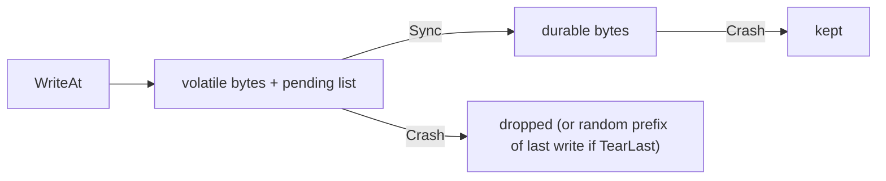

# 01 — Virtual File System (`internal/vfs`)

Status: **Approved and implemented (Step 0.2)**

## 1. Problem

A database must prove it survives crashes. Real crashes are hard to produce on demand, and the real file system hides what is durable and what is not. So every file operation in NoVacDB goes through one small interface, `vfs`. Two implementations exist:

- `OSFS`: the real file system, used by the server.
- `MemFS`: an in-memory file system for tests. It tracks which bytes are **durable** (survived an `fsync`) and which are **volatile**. It can simulate a crash, a torn write, and injected I/O errors.

No other package may import `os` for file access. This is what lets the WAL, disk manager and recovery code be tested against crashes later.

## 2. Design

```go
type FS interface {
    OpenFile(name string, flag int) (File, error) // flags: ORead, OWrite, OCreate, OExcl, OTrunc
    Remove(name string) error
    Rename(oldName, newName string) error
    List(dir string) ([]string, error)   // sorted base names
    MkdirAll(dir string) error
    SyncDir(dir string) error            // fsync a directory so creates/renames/removes are durable
}

type File interface {
    ReadAt(p []byte, off int64) (int, error)   // io.ReaderAt semantics
    WriteAt(p []byte, off int64) (int, error)  // io.WriterAt semantics
    Sync() error                                // make this file's data durable
    Truncate(size int64) error
    Size() (int64, error)
    Close() error
}
```

Choices:

- **Offset-based I/O only** (`ReadAt`/`WriteAt`). Pages and WAL records are addressed by offset, so there is no shared cursor and no seek state to get wrong. Concurrent reads and writes at different offsets are safe.
- **Small flag set** instead of `os` flag bits, so `MemFS` does not need to emulate everything `os` supports.
- **Sentinel errors**: `ErrNotExist`, `ErrExist`, `ErrClosed`, `ErrInjected`, plus (added during implementation) `ErrIsDir`, `ErrInvalid`, `ErrPermission` (operation not allowed by the open flags, enforced identically by both implementations) and `ErrFileTooLarge`. `OSFS` maps `os` errors onto these with `%w`, so tests behave the same on both.
- **Paths** are slash-separated and cleaned with `path/filepath` in `OSFS`. `MemFS` treats them as opaque cleaned strings in a flat map plus a set of directories.

### MemFS durability model

Each in-memory file keeps two byte slices:

- `durable`: contents as of the last successful `Sync`.
- `volatile`: the current contents that reads see.

Plus a list of **pending writes** (offset and bytes) made since the last `Sync`, so a torn write can be simulated.

Directory entries have the same split: a `durableNames` view and a `volatileNames` view. `Create`, `Rename` and `Remove` change only the volatile view until `SyncDir` runs on the parent directory. This catches the classic bug of fsyncing a new file but not its directory.

- `File.Sync()` sets `durable = volatile` for that file and clears its pending writes.
- `FS.SyncDir(dir)` promotes the volatile entries of `dir` to durable.
- `Crash(opts)` replaces volatile state with durable state for every file and directory:
  - `TearLast`: for each file with pending writes, the **last** unsynced write is kept only up to a random prefix of its bytes (chosen from a seeded `rand.Rand`). Earlier unsynced writes are dropped.
  - Open handles become invalid; using them returns `ErrClosed`.
- `InjectError(op, matcher)`: the next matching operation (by op kind such as `Sync`, `WriteAt`, `SyncDir`, optionally by file name and call number) returns `ErrInjected`. A failed `Sync` leaves the data non-durable, like a real failing disk.



### Implementation notes (differences from the first draft)

- `Remove` deletes files only; removing a directory returns `ErrIsDir` on both implementations.
- `SyncDir(dir)` also makes immediate subdirectory creation and removal durable. A directory whose own parent was never synced loses its files on `Crash`.
- API: `NewMemFS(seed)`, `Crash(CrashOptions{TearLast})`, `InjectError(Fault{Op, Name, After})` (one-shot), `ClearFaults()`.
- Handles opened before a `Crash` return `ErrClosed`; a handle on a removed file keeps working until closed, as on POSIX.

## 3. Formats

`vfs` has no on-disk or on-wire format of its own: it moves opaque bytes. `MemFS` state is in-memory only.

## 4. Concurrency

- `MemFS` has one `sync.Mutex` guarding all maps and file contents. Simple and correct beats fast for a test double.
- Each `memFile` handle holds a pointer to shared file state, so two handles on the same name see the same data, as with a real file system.
- `OSFS` relies on `os.File` thread safety (`ReadAt`/`WriteAt` are safe for concurrent use).
- `Crash` takes the lock and invalidates handles; calling it concurrently with I/O is allowed but the result is only meaningful once I/O has stopped.
- No global mutable state.

## 5. Failure and crash behaviour

- `OSFS.Sync` calls `(*os.File).Sync`. `OSFS.SyncDir` opens the directory and calls `Sync` on it. Errors are wrapped with `%w`, never swallowed. A failed `Sync` is returned to the caller; callers must treat the data as not durable (never retry and assume success).
- Short reads: `ReadAt` returns `io.EOF` with a short count at end of file, as `io.ReaderAt` requires.
- `WriteAt` past the end extends the file; the gap reads as zero bytes in both implementations.
- `Truncate` is volatile until `Sync`, like a write.
- Using a closed handle returns `ErrClosed`.
- After `Crash`, durable state is exactly what a power cut could leave behind: synced data, plus (with `TearLast`) a prefix of one unsynced write.

## 6. Alternatives considered

- **`io/fs.FS`**: read-only, no write or sync support. Rejected.
- **Wrapping `os` with hooks**: cannot model "volatile vs durable" because the OS page cache is invisible. Rejected.
- **Real crash testing only (kill -9, power loss VMs)**: does not lose page-cache data on kill -9, and is slow and non-deterministic. Kept only as a later OS-level script (Step 2.5).
- **A seekable `Read/Write/Seek` file**: shared cursor makes concurrent use error-prone. Rejected for `ReadAt/WriteAt`.
- **Per-page tearing** (partial sector-level tears of every pending write): more realistic but more complex. Deferred; tearing only the last write already catches torn WAL tails and torn pages.

## 7. Testing plan

- One behaviour suite (`suite_test.go`) taking a `func(t) FS` factory, run against both `OSFS` (rooted in `t.TempDir()`) and `MemFS`: create, exclusive create, open missing file, read/write at offsets, read past EOF, write past EOF (zero gap), truncate shrink and grow, rename (including over an existing file), remove, list ordering, closed-handle errors, concurrent reads and writes under `-race`.
- `MemFS`-only tests: unsynced write lost on `Crash`; synced write survives; write then partial `Sync` failure; new file lost if the directory was never `SyncDir`'d; rename not durable until `SyncDir`; `TearLast` keeps a prefix of length 0 to n-1 (seeded, many iterations, verified by checking prefix property); earlier unsynced writes dropped; every injected-error operation kind; handles unusable after `Crash`.
- Edge cases: empty reads and writes, zero-length truncate, offset at exact EOF, negative offsets (error), very large offset sparse write limit (explicit error above a documented cap so tests cannot exhaust memory).
- Seeds: `math/rand/v2` with a logged seed, overridable via `NOVACDB_SEED`.
- Target coverage at least 80%.
- No fuzz target: `vfs` decodes no bytes.

## 8. Limitations

- `MemFS` models only whole-file durability at `Sync` plus one torn write; it does not reorder independent unsynced writes or model sector-granular tearing.
- No file locking, no `mmap`, no `O_DIRECT` (planned for the buffer pool step, problem #7).
- No permissions, symlinks, or file times.
- `MemFS` sparse writes are capped (default 1 GiB, a named constant).
- Windows is not a supported target for `SyncDir`.
