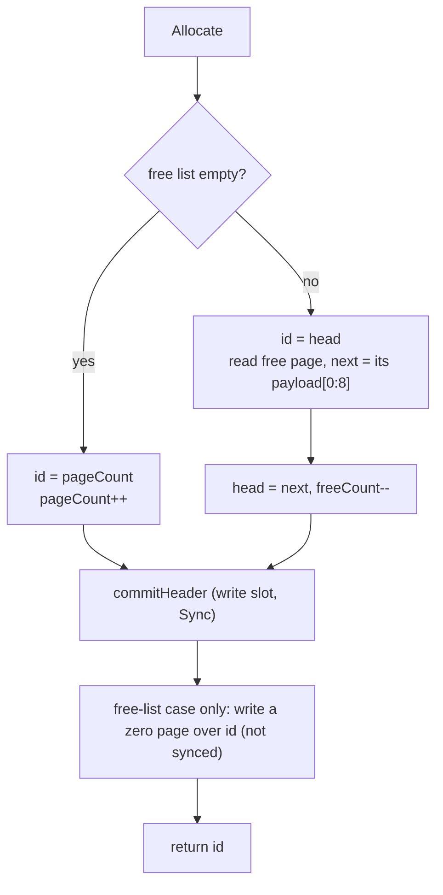

# 03 — Disk Manager (`internal/storage`)

Status: **Approved and implemented (Step 1.2)**

## 1. Problem

Pages (Step 1.1) need a home. The disk manager owns the single data file and offers the rest of the system four things:

1. **Read and write a page by ID.** Page N lives at byte offset N × 8192. Reads verify the checksum and ID; writes seal the page first.
2. **Allocate and free pages.** Freed pages are reused through a free list, so the file does not grow forever.
3. **A file header** that identifies the file (magic, format version, page size), records how many pages exist, and anchors the free list.
4. **A durable `Sync`**, so the buffer pool and (later) the WAL rule can say "this page is on disk".

All I/O goes through `internal/vfs`. There is no cache here (that is the buffer pool, Step 1.3) and no WAL yet (Phase 2). The design therefore has to stay safe against crashes **by itself**, within the limits listed in Section 5.

## 2. Design

### File layout


- **Pages 0 and 1 are two copies ("slots") of the file header.** Each header write goes to the slot *not* holding the current header, with a higher **generation** number. A torn or lost header write can therefore only damage the older copy, never the current one. On open, the valid slot with the highest generation wins. This is the same trick LMDB uses for its meta pages, and it costs one extra page.
- **Data page IDs start at 2.** Page ID 0 is never a data page, so in the free list `0` can mean "none".
- Page IDs 0 and 1 are reserved: `ReadPage`, `WritePage` and `Free` reject them.

### API (package `storage`)

```go
type DiskManager struct { /* unexported */ }

func Create(fsys vfs.FS, name string) (*DiskManager, error) // new file; fails with ErrExist if present
func Open(fsys vfs.FS, name string) (*DiskManager, error)

func (d *DiskManager) ReadPage(ctx context.Context, id uint64, buf []byte) error
func (d *DiskManager) WritePage(ctx context.Context, id uint64, buf []byte) error // seals buf (sets its CRC)
func (d *DiskManager) Allocate(ctx context.Context) (uint64, error)
func (d *DiskManager) Free(ctx context.Context, id uint64) error
func (d *DiskManager) Sync(ctx context.Context) error
func (d *DiskManager) PageCount() uint64     // includes the 2 header pages
func (d *DiskManager) FreePageCount() uint64
func (d *DiskManager) Close() error          // syncs, then closes
```

Behaviour:

- **`ReadPage`** reads 8192 bytes at `id × 8192`. Bytes past the end of the file read as zeros. It then calls `storage.Verify(buf, id)`. A page that was allocated but never written therefore returns `ErrZeroPage` (not corruption). IDs outside `[2, PageCount)` return `ErrInvalidPageID`.
- **`WritePage`** requires `buf` to be one page whose header ID equals `id` and whose type is valid, calls `Seal` (so the caller's buffer gets its CRC), and writes it at the page offset. **Not durable until `Sync`.**
- **`Allocate`** pops the head of the free list if there is one, otherwise extends the file by one page. The returned page reads as all zeros (`ErrZeroPage`) until first written. Durable when it returns.
- **`Free`** pushes a page onto the free list. Durable when it returns. It rejects reserved or out-of-range IDs and detects a double free when the page already has type `Free`.
- **`Close`** syncs the file and closes it. Using a closed manager returns `ErrClosed`.
- **`ctx`** is checked before any I/O starts. Once an operation has begun it runs to completion, because abandoning it halfway through a header update would leave memory and disk disagreeing.
- Maximum file size: page IDs are limited so `id × 8192` fits in `int64` (`MaxPages`); beyond that `Allocate` returns `ErrFull`.

### Header page contents

The header slot is a normal page (type `PageTypeFileHeader`, page ID = slot number 0 or 1, LSN 0, sealed with the usual CRC). Its payload holds the fields in Section 3.

### Create

Creation must be atomic, or a crash could leave a half-made file that neither `Create` nor `Open` accepts:

1. Remove any stale `name.tmp` from an earlier crashed attempt.
2. Create `name.tmp` (`OCreate|OExcl`), write slot 0 (generation 0, 2 pages, empty free list) and a zeroed slot 1.
3. `File.Sync`, `Close`, `Rename(name.tmp, name)`, then `SyncDir` on the parent directory.

After a crash, either `name` does not exist (retry `Create`) or it is complete. `Create` first checks that `name` does not exist.

### Open

1. Open the file read/write; read pages 0 and 1.
2. Classify each slot: **valid** (checksum ok, type `FileHeader`, ID equals slot, magic, version, page size and invariants all fine), **blank** (all zero), or **damaged** (anything else).
3. A slot that passes its checksum but has the wrong magic returns `ErrBadMagic`; wrong version `ErrUnsupportedVersion`; wrong page size `ErrPageSizeMismatch`. These are reported straight away rather than silently falling back to the other slot, because they mean "this is not our file", not "a write was torn".
4. Otherwise use the valid slot with the higher generation. Exactly one damaged or blank slot is normal (a torn header write, or a brand-new file). If **no** slot is valid, return `ErrCorrupt`.
5. A file shorter than expected is fine: pages never written read as zeros.

### Writing the header

`commitHeader(h)` increments the generation, encodes the header, writes it to slot `generation % 2`, and `Sync`s the file. After it returns, the new header is durable and the previous one is still intact in the other slot.

### Allocate



The zeroing write happens **after** the header is durable. If it is lost in a crash the page keeps its old `Free` image, which is harmless (see Section 5). Extension needs no page write: bytes beyond the end of file read as zeros.

### Free

1. Validate `id`. Read the page: `ErrZeroPage` (allocated, never written) or any valid non-`Free` page is fine; a valid `Free` page returns `ErrDoubleFree`; a damaged page returns its error (corruption is not hidden).
2. Write a sealed `Free` page for `id` whose payload `[0:8]` is the current free-list head, then `Sync`.
3. `commitHeader` with `head = id`, `freeCount++`.

Order matters: the free page is durable *before* the header points at it, so the list never leads to a page that is not a valid `Free` page.

### Poisoned state

If any I/O step of `Allocate`, `Free` or `Sync` fails, memory and disk may disagree and a failed `fsync` may have dropped data. The manager marks itself **failed** and every later call returns `ErrFailed` until the file is reopened (which re-reads the durable state). It never retries an `fsync` and assumes success.

### Implementation notes (differences from the first draft)

- The initial header is **generation 0** in slot 0 (slot = generation % 2), so the first header commit has generation 1 and lands in slot 1.
- A header slot must satisfy `generation % 2 == slot`; otherwise it is treated as damaged.
- `Close` on a failed manager skips the final sync and just closes the file.
- Errors: `ErrInvalidPageID`, `ErrCorrupt`, `ErrBadMagic`, `ErrUnsupportedVersion`, `ErrPageSizeMismatch`, `ErrDoubleFree`, `ErrDiskClosed`, `ErrFailed`, `ErrFull`.
- `WritePage` also rejects pages of type `FileHeader` and `Free` (managed by the disk manager itself).
- A page allocated from the free list whose zeroing write was lost in a crash may still hold its old `Free` image, or a torn mix of it; callers must write a page before reading it. `Free` of such a torn page returns `ErrChecksum` rather than hiding the damage.

## 3. Formats

All integers little-endian.

Header slot payload (starts at page offset 24):

| payload offset | size | field | notes |
|---|---|---|---|
| 0 | 8 | Magic | bytes `"NOVACDB\0"` |
| 8 | 4 | FormatVersion | uint32, currently 2 (1 before B+Tree leaf cells gained a Flags byte, 08-btree.md revision 2; version 1 files are refused) |
| 12 | 4 | PageSize | uint32, must equal 8192 |
| 16 | 8 | Generation | uint64; slot used = generation % 2; higher wins |
| 24 | 8 | PageCount | uint64; total pages including the 2 header pages; ≥ 2 |
| 32 | 8 | FreeListHead | uint64; page ID of first free page, 0 = empty |
| 40 | 8 | FreePageCount | uint64; length of the free list |
| 48 | 8120 | reserved | zero |

Invariants checked on open: `PageCount >= 2`; `FreeListHead == 0` iff `FreePageCount == 0`; if non-empty, `2 <= FreeListHead < PageCount` and `FreePageCount <= PageCount - 2`.

Free page (type `PageTypeFree`, page ID = its own ID, LSN 0):

| payload offset | size | field | notes |
|---|---|---|---|
| 0 | 8 | NextFree | uint64; next page in the free list, 0 = end |
| 8 | 8160 | reserved | zero |

The free list is a LIFO stack: the most recently freed page is allocated first. Both layouts are repeated in comments above the encode/decode code.

## 4. Concurrency

- One `sync.RWMutex` in the manager. `ReadPage` and `WritePage` take the read lock, so reads and writes of different pages run in parallel (`ReadAt`/`WriteAt` are safe for concurrent use). `Allocate`, `Free`, `Sync` and `Close` take the write lock, so header changes are serialized and no read observes a half-finished free-list update.
- Two goroutines writing the *same* page concurrently is a caller bug; the buffer pool (Step 1.3) prevents it with pins and latches. The disk manager does not check.
- The manager does not lock the file against other processes (see Limitations).
- No global mutable state.

## 5. Failure and crash behaviour

What is guaranteed **at this layer, without a WAL**:

| Event | Result |
|---|---|
| Crash during `Create` | `name` absent (retry) or complete. |
| Torn or lost header write | The older slot is intact; open uses it. The operation that was in flight is simply not applied. |
| Crash before `Sync` after `WritePage` | The page may be old, new, or torn (torn is caught by the checksum). Synced pages are never damaged. |
| Crash during `Allocate` | Either the old or the new header is current. A page is never handed out unless the header that gives it away is durable, so **a page is never allocated twice**. |
| Crash during `Free`, after the free page is written but before the header commit | The page is a valid `Free` page that the header does not list: it is **leaked** (unreachable) until a later full-file check or recovery. Never double-allocated, never a loop in the list. |
| I/O error | Manager enters the failed state; reopen to continue. |
| Bad checksum on read | `ErrChecksum` returned to the caller; nothing is repaired here. |

Known weakness, deliberate and temporary: **`Free` is destructive.** Step 2 of `Free` overwrites the page with a `Free` image before the header commit. If the crash happens between those two steps, the page content is gone even though the header still shows it in use. Without a WAL this layer cannot make "free this page" atomic together with the higher-level operation that decided to free it (for example dropping a table). From Step 2.3 on, every such change is logged first, and recovery redoes or undoes it. Until then, callers must only free pages whose contents are no longer needed.

## 6. Alternatives considered

- **Single header page.** Simpler, but a torn header write destroys the whole file, and without a WAL nothing can repair it. Rejected.
- **Header protected only by the WAL later.** Does not help the period before Step 2 and makes recovery depend on the header it is trying to recover. Rejected.
- **Free-space bitmap pages instead of a linked list.** O(1) free without touching the freed page and no destructive overwrite, but bitmap pages are themselves 8 KiB writes that need torn-write protection and grow with the file. A linked free list needs only the header. May be revisited with the WAL in place.
- **Free list stored in the header.** Bounded size; the header would overflow after about a thousand free pages.
- **Write-ahead "intent" file for allocation.** That is a mini WAL; building the real WAL later is better than inventing a second mechanism.
- **Truncate the file on every extension.** Adds a metadata change and an extra fsync per page. Reading missing bytes as zeros is simpler and equally safe.
- **Journaling allocation in `WritePage`'s Sync.** Mixing durability of data pages and metadata would make `Sync` semantics surprising.
- **Memory-mapped I/O.** Hides I/O errors as signals and breaks the vfs fault model. Rejected.

## 7. Testing plan

Unit tests, table-driven, run against `MemFS` and `OSFS` (shared suite like vfs):

- `Create` then `Open`: header fields round-trip; `Create` on an existing file fails with `ErrExist`; `Open` on a missing file fails with `ErrNotExist`.
- Pages survive reopen: write N pages with distinct contents, `Sync`, `Close`, `Open`, read back identical.
- Allocation: IDs start at 2 and increase; `PageCount` grows; freed pages are reused LIFO; free count tracks; allocated-unwritten page returns `ErrZeroPage`.
- Errors: reserved IDs 0 and 1, `id >= PageCount`, wrong buffer size, header ID not equal to `id`, double free, use after `Close`, cancelled context (before I/O only).
- Corrupt and foreign files: empty file, file of random bytes (`ErrCorrupt`/`ErrBadMagic`), good header with wrong magic, with a future version, with version 1, with page size 4096, both slots damaged, one slot damaged (open succeeds on the other), higher generation wins, flipped byte in each header field area, free list head out of range.
- Injected I/O errors on every `Write`, `Sync`, `Rename` and `SyncDir` step of `Create`, `Allocate`, `Free`: the manager enters the failed state (`ErrFailed`), and reopening yields a consistent file.
- Edge cases: exactly `MaxPages` reached (`ErrFull`, using a hook to set a small limit), freeing and allocating the last page.
- Concurrency: many goroutines writing/reading distinct pages while others allocate and free, under `-race`, also with `-count=20`.

**Crash tests (`MemFS`)** — the Step 1.2 acceptance criterion. Seeded loop (seed logged, `NOVACDB_SEED` overridable), thousands of runs:

1. Perform random operations (`Allocate`, `WritePage` of random content, `Free`, `Sync`) against the disk manager and a simple model that records which page contents are durable.
2. Stop at a random point: either at an operation boundary, or *inside* an operation via an injected error on the k-th `WriteAt`/`Sync`; then `MemFS.Crash` with `TearLast` on or off.
3. Reopen and check: `Open` succeeds; every page that was written, then synced, and not touched by a `Free` afterwards reads back byte-identical; walking the free list visits exactly `FreePageCount` distinct valid `Free` pages; no free page is also a live page in the model; allocating until the free list is exhausted never returns a live page.

A failing seed reproduces the exact run.

**Fuzz:** `FuzzOpen` feeds arbitrary bytes as the first two pages (seeded with valid headers) and requires that `Open` never panics and either returns an error or a manager whose invariants hold.

Coverage target at least 80%; `go test -race -count=20` for the concurrency tests.

## 8. Limitations

- No WAL yet: `Free` is destructive and not atomic with higher-level operations; leaked pages after a crash are not reclaimed (a consistency checker comes later).
- One `fsync` per `Allocate` and two per `Free`. Batching comes after correctness.
- The file never shrinks; freed pages are reused but not returned to the OS.
- No inter-process locking: two processes opening the same file would corrupt it.
- No direct I/O or read-ahead (problem #7 is addressed with the buffer pool).
- LIFO free list gives no locality.
- No tail-page recovery for a file shorter than `PageCount` beyond reading zeros.
