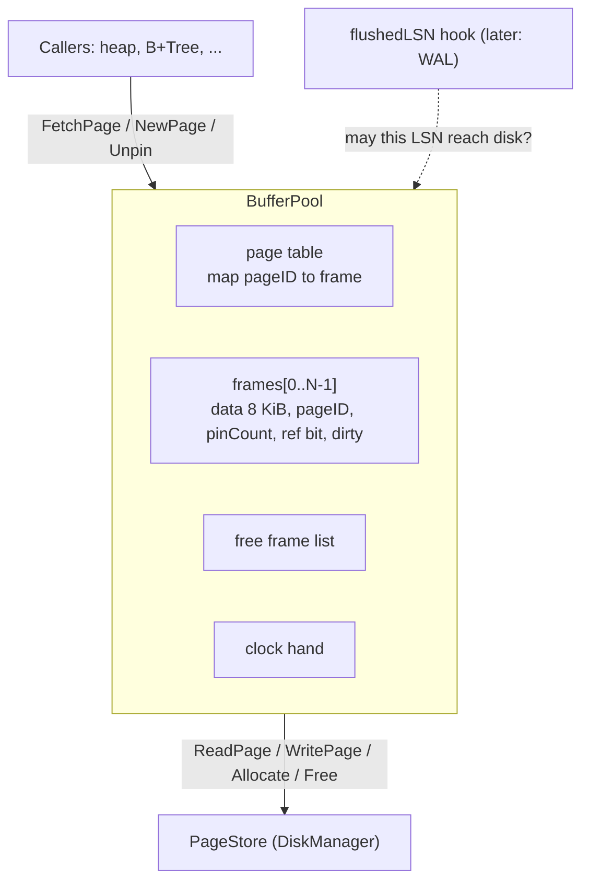

# 04 — Buffer Pool (`internal/storage`)

Status: **Draft, awaiting approval**

## 1. Problem

Every page access would otherwise be a disk read and every change a disk write. The buffer pool keeps a fixed number of pages in memory ("frames") and gives the rest of the system three guarantees:

1. **Pinning.** A page handed to a caller stays in memory, at the same address, until the caller releases it. Callers never see a page being swapped out from under them.
2. **Write-back.** Changed ("dirty") pages are written to disk lazily, when they are evicted or flushed, not on every change.
3. **A hook for the WAL rule.** A page whose LSN is greater than what the WAL has flushed must not be written to disk. The pool enforces this through a function supplied by the WAL later (Step 2.3).

The pool sits between users (heap, B+Tree, catalog) and the disk manager. It adds no on-disk format. It also does not call `fsync`: making written pages durable is the job of whoever calls `DiskManager.Sync` (a checkpoint, in Step 2.4).

## 2. Design



### The store interface

Defined where it is used, so tests can substitute a fake with fault injection:

```go
type PageStore interface {
    ReadPage(ctx context.Context, id uint64, buf []byte) error
    WritePage(ctx context.Context, id uint64, buf []byte) error // seals buf
    Allocate(ctx context.Context) (uint64, error)
    Free(ctx context.Context, id uint64) error
}
```

`*DiskManager` already satisfies it.

### API

```go
type Options struct {
    Frames     int               // number of 8 KiB frames, at least 1
    FlushedLSN func() uint64     // WAL rule hook; nil means "no WAL yet": any page may be written
}

func NewBufferPool(store PageStore, opts Options) (*BufferPool, error)

func (bp *BufferPool) FetchPage(ctx context.Context, id uint64) (*PageRef, error)       // pin, loading from disk if needed
func (bp *BufferPool) NewPage(ctx context.Context, t PageType) (*PageRef, error)        // allocate on disk + pin, header initialised, dirty
func (bp *BufferPool) DeletePage(ctx context.Context, id uint64) error                  // drop from pool, free on disk; must be unpinned
func (bp *BufferPool) FlushPage(ctx context.Context, id uint64) error                   // write one dirty page (no fsync)
func (bp *BufferPool) FlushAll(ctx context.Context) error                               // write all dirty pages (no fsync)
func (bp *BufferPool) Close(ctx context.Context) error                                  // FlushAll, fail if any page is pinned
func (bp *BufferPool) Stats() Stats                                                     // hits, misses, evictions, writes

// A PageRef is one pin on one page. Each Fetch/New returns a fresh PageRef.
func (r *PageRef) ID() uint64
func (r *PageRef) Data() []byte           // the full 8192-byte page, valid until Unpin
func (r *PageRef) Lock(); Unlock()        // exclusive content latch: hold while modifying Data
func (r *PageRef) RLock(); RUnlock()      // shared content latch: hold while reading when others may modify
func (r *PageRef) Unpin(dirty bool) error // release the pin; dirty=true if the caller changed the page
```

Rules for callers (documented on the types):

- `Data()` aliases a frame. Never touch it after `Unpin`.
- Hold the exclusive latch while modifying, the shared latch while reading something others may modify. Release latches **before** `Unpin`.
- A second `Unpin` on the same `PageRef` returns `ErrAlreadyUnpinned`; it never decrements twice.
- Pass `dirty=true` if the page was changed. The WAL step will also have callers update the page's header LSN inside `Data()`; the pool reads it at write time.

### Frame state

| field | protected by | meaning |
|---|---|---|
| `data [8192]byte` | content latch (`sync.RWMutex`) while pinned | page bytes |
| `pageID`, `valid` | pool mutex | which page lives here |
| `pinCount` | pool mutex | number of live `PageRef`s |
| `refBit` | pool mutex | Clock second-chance bit |
| `dirty` | atomic | page differs from disk |
| `flushMu` | itself | serialises writes of this page |

### Fetch (cache hit and miss)

1. Lock the pool mutex. If the page is in the page table: `pinCount++`, set `refBit`, return a new `PageRef` (**hit**).
2. **Miss:** get a frame: pop one from the free list, otherwise run Clock to choose a victim (below). If the victim is dirty, write it back first. If that write fails, return the error and leave the victim untouched (still resident, still dirty).
3. Read the page from the store into the frame. If the read fails (including `ErrZeroPage` for a page that was allocated but never written, or a checksum error), give the frame back to the free list and return the error. No half-loaded frame is ever visible.
4. Insert into the page table, `pinCount = 1`, `refBit = true`, return.

### Clock replacement

A hand sweeps the frames in order. For the frame under the hand:

- pinned (`pinCount > 0`) → skip;
- dirty and its page LSN is greater than `FlushedLSN()` → skip (it may not be written yet);
- `refBit` set → clear it (second chance), advance;
- otherwise → this is the victim.

The sweep stops after two full rounds (every `refBit` has then been cleared once). If no victim was found, return `ErrNoFreeFrames`: every frame is pinned or blocked on the WAL. The caller can retry after releasing pins.

Clock approximates LRU with one bit per frame and no list to maintain on every hit. An unpinned page has no users, so it is safe to read its LSN and write it without taking any latch.

### Write-back and flush

- **Eviction write-back:** the victim is unpinned, so no one can be using its bytes. The pool checks the WAL hook, then calls `store.WritePage` directly on the frame. `WritePage` seals (sets the CRC) and writes.
- **`FlushPage` / `FlushAll`:** the page may be pinned and in use, so the pool works on a copy:
  1. Under the pool mutex find the frame, `pinCount++` (so it cannot be evicted), release the pool mutex.
  2. Take `flushMu`, then the content **shared** latch. Copy the 8 KiB into a scratch buffer, read its LSN from the copy, check the WAL hook (if the LSN is too new: release everything, unpin, return `ErrWALRule`), and clear the dirty flag. Release the latch.
  3. Write the scratch copy with `store.WritePage` (outside the latch and the pool mutex). If it fails, set the dirty flag again and return the error.
  4. Release `flushMu`, then unpin under the pool mutex.
- Why copy: sealing writes the CRC bytes into the buffer, which would race with readers holding only the shared latch, and a slow disk write would hold the latch against writers.
- Why clear dirty at copy time: a modifier sets dirty (in `Unpin(true)`) after it releases its latch. Clearing at copy time means a change made after the copy re-dirties the page and is never lost; the worst case is one unnecessary extra write. Clearing after the write could silently drop a change.
- Why `flushMu`: two concurrent flushes of one page could write an older copy after a newer one while the dirty flag says "clean". Serialising them makes the last write always the newest copy.
- `FlushAll` snapshots the IDs of dirty frames, flushes each one, and returns all errors joined. It does not stop other goroutines from dirtying pages meanwhile; a checkpoint needs only "everything dirty at the moment I started".

### NewPage and DeletePage

- `NewPage` first obtains a frame (so a full pool fails before anything is allocated), then calls `store.Allocate`, and if that fails returns the frame to the free list. It then initialises the header (`InitPage`) and marks the frame dirty: the new page exists only in memory until flushed.
- `DeletePage` requires `pinCount == 0` (`ErrPagePinned` otherwise). It calls `store.Free` first; only on success does it drop the page from the table and discard its in-memory (possibly dirty) contents without writing them.

### Context and errors

All functions that can do I/O take `ctx` first and check it before starting. Once started, an operation completes. Waiting for the pool mutex is not interruptible.

Sentinel errors: `ErrNoFreeFrames`, `ErrPagePinned`, `ErrAlreadyUnpinned`, `ErrWALRule`, `ErrPoolClosed`, `ErrBadPoolSize`. Store errors are wrapped with `%w`.

## 3. Formats

None. The pool has no on-disk or on-wire format; it reads and writes whole pages in the format of Step 1.1 through the store. Page content is opaque to it, apart from reading the LSN at header offset 8 (see `docs/design/02-page-format.md`).

## 4. Concurrency

Three kinds of lock, with a strict order.

- **Pool mutex** (`sync.Mutex`): page table, free list, clock hand, and per-frame `pinCount`, `refBit`, `pageID`. In this step it is **held across disk I/O on misses and eviction write-backs.** That is simple and obviously correct, at the price that a miss blocks other pool operations. Releasing it during I/O needs an "I/O in progress" frame state and waiter handling; that is a real optimisation, to be made with benchmarks (Phase 8), not now.
- **`flushMu`** per frame: serialises flushes of one page.
- **Content latch** per frame (`RWMutex`, exposed through `PageRef`): protects the bytes of a pinned page.

Rules that prevent deadlock:

1. **Never wait for a content latch or `flushMu` while holding the pool mutex.** `FlushPage` pins under the pool mutex, releases it, and only then takes `flushMu` and the latch.
2. Eviction only touches unpinned frames. A frame with no pins has no latch holders, so the evictor never needs a latch.
3. Callers release latches before `Unpin`.
4. The order of acquisition, when more than one is held, is always `flushMu` → latch. The pool mutex is taken separately from both.

Other points:

- `dirty` is an atomic so `Unpin(true)` and flushing do not need the pool mutex for it.
- A frame pinned by an in-flight flush cannot be evicted, so a tiny pool under heavy `FlushAll` can see a transient `ErrNoFreeFrames`.
- Two goroutines may pin the same page; both get a `PageRef`. Coordinating their access to the bytes is up to them, using the content latch.
- No global mutable state.

## 5. Failure and crash behaviour

| Event | Result |
|---|---|
| Read from store fails | Frame returned to the free list, error returned, pool unchanged. |
| Write-back of a victim fails | Victim stays resident and dirty; the Fetch fails with the error. |
| `FlushPage` write fails | Dirty flag restored; error returned; page still in memory. |
| `store.Allocate` fails in `NewPage` | Frame returned; nothing allocated. |
| `store.Free` fails in `DeletePage` | Page stays in the pool unchanged. |
| WAL hook says "not yet" | Eviction skips the page; `FlushPage` returns `ErrWALRule`. |
| Process crash | **All dirty pages that were not written and synced are lost.** That is by design: the WAL (Phase 2) is what makes those changes recoverable. Pages that were flushed and synced survive (the disk manager's guarantees apply). |
| `Close` with pinned pages | `ErrPagePinned`; nothing is closed. |

The pool never retries a failed write or silently drops a dirty page.

## 6. Alternatives considered

- **LRU list instead of Clock.** Exact recency, but every hit must update a shared list under a lock. Clock needs one bit and no list manipulation on hits. Both can suffer from sequential-scan flooding; scan resistance is deferred.
- **LRU-K / 2Q / ARC.** Better hit rates, more state and more tuning. Not justified before there are benchmarks.
- **Hold the pool mutex only briefly and do I/O outside it** (per-frame "loading" state, waiting readers). Higher concurrency; rejected for this step as the main source of subtle bugs. The interface does not change if we do it later.
- **Sharded page table** (one mutex per hash bucket). Same reasoning: optimise later.
- **Return raw `[]byte` and a separate `Unpin(id)`.** Can't detect a double unpin or a unpin of the wrong pin, and can't carry the latch. A per-pin `PageRef` handle fixes both.
- **Flush by writing the frame directly under the shared latch.** Would write the CRC into a buffer others are reading and would hold the latch during disk I/O.
- **Clear the dirty flag after the write completes.** Can lose a change made between the copy and the clear.
- **Force the WAL from inside the pool** (call "flush WAL up to LSN" instead of refusing). That is likely what Step 2.3 adds, as an optional second hook. Refusing is the minimal, testable contract for now.
- **Evict by background writer thread.** Not needed yet.

## 7. Testing plan

A fake `PageStore` (in-memory map) in tests counts reads, writes, allocations and frees, and can inject errors on chosen calls. A test-only method `checkInvariants` verifies, after every operation in the model test: the page table and frames agree (each entry points to a valid frame holding that page ID, no page resident twice); every frame is in exactly one of {free list, page table}; the sum of `pinCount` equals the number of live `PageRef`s the test holds; resident pages never exceed `Frames`.

- **Unit tests (table-driven):**
  - `NewBufferPool` with 0, negative, and 1 frame(s); `NewPage` then `FetchPage` returns the same bytes; hit and miss counts.
  - Pool of 2 frames, pin both, third fetch returns `ErrNoFreeFrames`; after one `Unpin` it succeeds.
  - **Eviction writes dirty pages** (store write count and contents), and **clean pages are not written**.
  - Clock second chance: with a hand position and reference bits arranged deterministically, the expected victim is evicted.
  - Pinned pages never evicted, even when everything else is.
  - Double `Unpin` returns `ErrAlreadyUnpinned` and leaves `pinCount` right; `Unpin` after `Close`.
  - `DeletePage` of a pinned page, of a dirty page (not written), of a page not resident; the page is freed in the store.
  - `FlushPage` of clean, dirty, non-resident and pinned pages; `FlushAll` joins errors; flush failure re-dirties.
  - WAL hook: dirty page with LSN above `FlushedLSN()` is not evicted and `FlushPage` returns `ErrWALRule`; once the hook returns a larger value both succeed; a clean page with a high LSN is evictable; `nil` hook means no restriction.
  - I/O errors: read failure leaves no leaked frame (fetch the same page again after the fault clears); write-back failure keeps the victim; `Allocate` and `Free` failures; cancelled context before I/O.
  - Fetch of an allocated-never-written page returns `ErrZeroPage`; of a corrupt page returns `ErrChecksum`; frames are not leaked.
  - `Close` flushes everything and refuses when pins remain.
- **Model-based test:** thousands of random operations (seeded, logged, `NOVACDB_SEED`) over a pool of 3–8 frames and up to ~60 pages: new, fetch-and-modify, fetch-and-read, delete, flush, flush-all, with several pins held at once. A map model holds the expected content of every live page. After each step, `checkInvariants` runs and a sample page is read through the pool and compared to the model. At the end `FlushAll` and the store's contents are compared to the model for every live page.
- **Concurrency tests (`-race`, also `-count=20`):** many goroutines fetch, modify (under the exclusive latch, writing a version stamp over the whole payload), read (under the shared latch, checking the payload is self-consistent), and unpin on a page set larger than the pool; concurrent `FlushAll`; one test with a tiny pool and more goroutines than frames to exercise `ErrNoFreeFrames` handling and retries. At the end, no pins remain and the flushed store contents match the last stamps.
- **Integration with the real `DiskManager` on `MemFS`:** pages flushed and synced survive `Crash`; dirty pages never flushed are gone; reopened pool reads the synced contents.
- No fuzz target (no decoder). Coverage target at least 80%.

## 8. Limitations

- One pool mutex held across disk I/O: misses serialise (a documented, measured-later bottleneck).
- No scan resistance, prefetch or read-ahead; no background writer.
- Pool does not call `fsync`; callers sync the store after flushing.
- No direct I/O, so the OS page cache still double-buffers (WORKFLOW problem #7 is **not** fixed by this step).
- The WAL hook only refuses; forcing the WAL is added with the WAL.
- `FlushAll` is not a point-in-time snapshot.
- Capacity is fixed at construction; no resizing.
- A transient `ErrNoFreeFrames` is possible if many frames are pinned by in-flight flushes.
