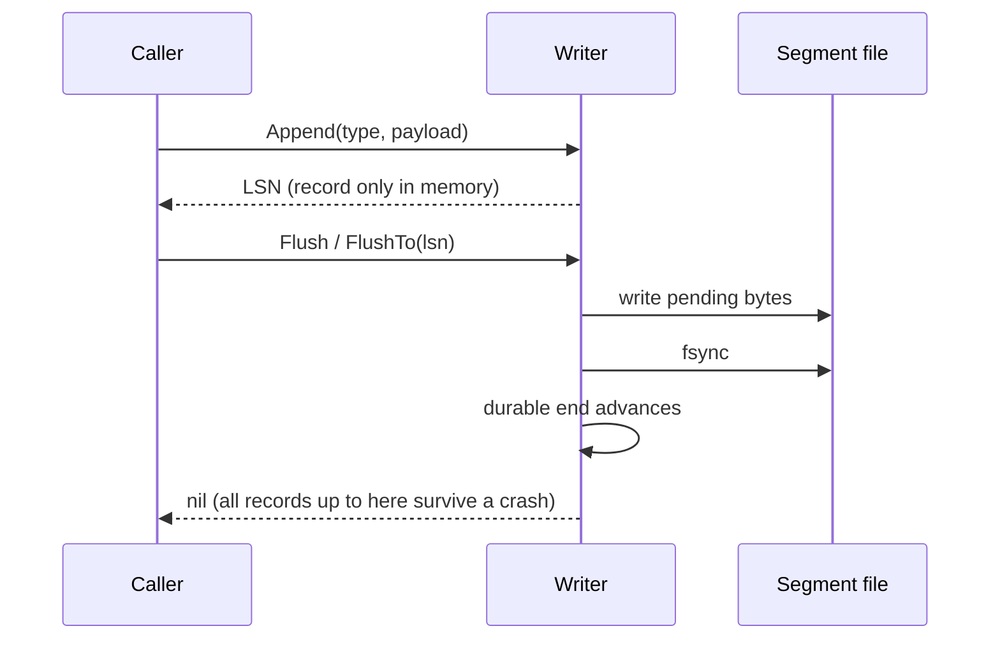

# 06 — WAL Writer and Reader (`internal/wal`)

Status: **Writer implemented in Step 2.1, reader in Step 2.2; written and approved under the standing autonomous-mode instruction**

## 1. Problem

The data file is changed page by page, in memory, and written back lazily. A crash can therefore lose changes or leave the file half-updated. The **write-ahead log** records every change *before* the changed page may reach disk, and `COMMIT` is acknowledged only once its log records are on disk (fsynced). After a crash the log is replayed (Steps 2.3–2.5) to restore every acknowledged change.

This step builds the **writer** only:

- a record format: LSN, length, type, CRC-32C, payload;
- segment files that hold the log;
- `Append` (buffered), `Flush` (write + fsync), and tracking of what is durable;
- on open, finding the end of the log after a crash and cutting off a half-written tail.

The log has no knowledge of what records mean (heap insert, commit, ...): payloads are opaque bytes and the record type is a number owned by later steps. The full sequential **reader** with torn-tail handling for recovery is Step 2.2; this step contains only the minimum decoding the writer itself needs (one record at a time, and a scan of the last segment on open).

## 2. Design

### LSNs and segments

**The log is the concatenation of its segment files, and an LSN is the byte offset of a record's first byte in that concatenation** (a locked project decision). Segment 0 starts at offset 0 with a 32-byte segment header, so the first record has LSN 32 and **LSN 0 never names a record**: page LSN 0 means "never logged".


- A segment file is named `wal-<start LSN as 16 hex digits>.seg`, so the name alone says where it fits in the log, and names sort in log order.
- **Segments are variable length.** A record is never split across segments. When the next record would push the current segment past `SegmentSize`, the writer starts a new segment whose start LSN is exactly the end of the previous one. A segment always holds at least one record, so a record larger than `SegmentSize` simply gets a segment of its own.
- Because segment length is only known when the segment is finished, no padding is ever written and LSNs are gap-free apart from the 32-byte header at each segment start.
- Old segments will be deleted by checkpoints (Step 2.4); names keep their LSNs, so offsets stay stable.

### Records

Each record is a 20-byte header plus payload (layout in section 3). The header contains the record's **own LSN**, covered by the checksum. A reader that finds a record at file offset `o` of segment `s` can require `LSN == s.start + o`; stale, misplaced or recycled bytes then cannot be mistaken for the real next record. Type 0 is invalid, so zeroed space never decodes as a record.

### Appending, flushing, durability



- `Append` assigns the LSN, encodes the record into an in-memory buffer and returns. It does no I/O, except that when more than `MaxPendingBytes` are buffered it calls `Flush` itself, so memory is bounded.
- `Flush` writes the buffered bytes to the segment file(s) and `fsync`s. Only after the fsync does the **durable end** advance. `FlushTo(lsn)` returns immediately if the record at `lsn` is already durable, otherwise flushes everything pending.
- When a flush crosses into a new segment it: writes and fsyncs the old segment **before** creating the new file, writes the new header and records, fsyncs the new file, then fsyncs the **directory** (project rule: fsync the parent directory after creating a file). Invariant: *every segment except the last is complete and durable*.
- **Durable end** (`DurableEnd()`) is a record boundary: every record that starts below it is wholly durable. `FlushedLSN()` returns `DurableEnd() - 1`, "the greatest LSN whose record, if there is one, is durable". It is exactly the function the buffer pool's WAL rule needs (`pageLSN <= FlushedLSN()` allows a write), where a page's LSN is the **start** LSN of the last record that changed it. Comparing with the record's *end* instead would be off by one in the unsafe direction, so the semantics are fixed here and tested against the real buffer pool.
- Group commit falls out of the structure: flushes are serialised, so a caller that waits for an in-flight flush finds its record already durable (or flushes everything appended since).

### Opening and finding the end of the log

`Open(fsys, dir, opts)`:

1. Create `dir` if missing (and fsync the parent).
2. List `wal-*.seg` files, parse their start LSNs, sort.
3. **No segments:** create segment 0 (header written, fsynced, directory fsynced).
4. Otherwise validate **every** segment header (CRC, magic, version, start LSN equals the name). A final segment that is too short to hold a header, or whose header is invalid *and* whose size is at most the header size, is leftover from a crash while creating it. It cannot contain records, so it is deleted (directory fsynced). Any other invalid header is `ErrCorrupt`, and nothing is deleted.
5. Check **contiguity**: each segment's start must equal the previous segment's start plus its file size, else `ErrCorrupt`.
6. Scan the **last** segment from its header, decoding records and requiring each to carry its expected LSN. Stop at the first record that is incomplete, fails its checksum, or has the wrong LSN. Everything from there on is a torn tail: **truncate** the file to the last good record and fsync it. (Earlier segments are complete by the invariant above.)
7. fsync the **directory**, then continue appending at the end of the last segment. Durable end is its end, because the recovered bytes and the directory entries have just been fsynced.

Step 7 and the fsync in step 6 exist because a *killed process* is not a *power cut*. After a kill the operating system still holds everything it was given, synced or not, and shows it to the next `Open`; a later power cut would then take back whatever was never fsynced, including segment files whose directory entries were never synced. `Open` reports what it found as durable, so it must make that true. (A flush that dies after creating several segments leaves exactly such files. This was found by the crash test's process-kill mode, and `TestOpenMakesSegmentEntriesDurable` pins it.) Segment contents need no extra sync: each segment is fsynced before the next one is created.

Scanning stops at the first bad record, as PostgreSQL does, rather than refusing to start. After a power cut, writeback can have persisted later pages of an unsynced tail without earlier ones, so valid-looking records after a hole are normal and were never acknowledged. The cost: bit rot in an acknowledged record in the middle of the last segment makes everything after it disappear silently. Detecting that is recovery's job (Step 2.2 reports a checksum failure that is followed by valid records), and it is listed under Limitations.

### Reader (Step 2.2)

`NewReader(fsys, dir, from)` reads records sequentially from `from` to the end of the log, across segments. It shares the directory scan with the writer's `Open` (`scanSegments`: header checks, start-LSN-matches-name, contiguity, leftover detection) and the per-segment record walk (`scanRecords`), so **the reader and recovery agree by construction** about where the log ends.

- `from` must be the LSN of a record, the start of a segment, or the end of the log. The reader proves it by walking the segment's records up to it; anything else (inside a record or a header, before the oldest segment, past the end) is `ErrLSNNotFound`. A redo start point that is not in the log means log has been lost, and must not be skipped silently.
- In every segment except the last, records must be complete, valid, at their own LSN, and fill the file exactly; otherwise `ErrCorrupt`. In the last segment the first bad record is the end of the log (`io.EOF`), exactly as the writer's `Open` decides, and `End()` reports where that is.
- The reader never modifies anything and ignores a leftover last segment that cannot hold records.
- It reads one segment into memory at a time; payloads stay valid after later calls.
- `FirstLSN(fsys, dir)` returns the first record position of the oldest remaining segment, where a full replay starts.

API:

```go
func NewReader(fsys vfs.FS, dir string, from LSN) (*Reader, error)
func (r *Reader) Next() (Record, error) // io.EOF at the end; ErrCorrupt for damage before the last segment
func (r *Reader) End() LSN
func FirstLSN(fsys vfs.FS, dir string) (LSN, error)
```

### Failure handling

Any I/O error during a flush, an open-time truncate, or a segment switch **poisons** the writer (`ErrFailed`): memory and disk may disagree, and a failed fsync may have dropped the data, so nothing is retried. Reopen to continue. Buffered records are lost, which is allowed because they were never acknowledged.

### API (package `wal`)

```go
type LSN uint64
type RecordType uint16

type Options struct {
    SegmentSize     int64 // soft limit per segment file; 0 = 16 MiB
    MaxPendingBytes int   // Append flushes when this much is buffered; 0 = 1 MiB
}

func Open(fsys vfs.FS, dir string, opts Options) (*Writer, error)
func (w *Writer) Append(ctx context.Context, t RecordType, payload []byte) (LSN, error)
func (w *Writer) Flush(ctx context.Context) error
func (w *Writer) FlushTo(ctx context.Context, lsn LSN) error
func (w *Writer) EndLSN() LSN        // where the next record will start
func (w *Writer) DurableEnd() LSN    // all records starting below this are durable
func (w *Writer) FlushedLSN() LSN    // DurableEnd()-1; plug into the buffer pool WAL-rule hook
func (w *Writer) Close(ctx context.Context) error // flush, then close

// Record format, shared with the future reader.
type Record struct { LSN LSN; Type RecordType; Payload []byte }
func AppendRecord(dst []byte, lsn LSN, t RecordType, payload []byte) []byte
func DecodeRecord(buf []byte) (Record, int, error)
```

Errors: `ErrShortRecord`, `ErrBadRecord`, `ErrChecksum`, `ErrCorrupt`, `ErrBadMagic`, `ErrUnsupportedVersion`, `ErrInvalidOptions`, `ErrInvalidType`, `ErrPayloadTooLarge`, `ErrClosed`, `ErrFailed`.

## 3. Formats

All integers little-endian. CRC-32C is the Castagnoli polynomial (`hash/crc32`).

Segment header (32 bytes at file offset 0):

| offset | size | field | notes |
|---|---|---|---|
| 0 | 4 | CRC-32C | over bytes 4..32 |
| 4 | 8 | Magic | `"NOVAWAL\0"` |
| 12 | 4 | FormatVersion | uint32, currently 1 |
| 16 | 8 | StartLSN | uint64; LSN of this file's first byte; equals the number in the file name |
| 24 | 8 | reserved | zero |

Record (starts at file offset 32, then back to back):

| offset | size | field | notes |
|---|---|---|---|
| 0 | 4 | CRC-32C | over bytes 4..20+PayloadLen |
| 4 | 4 | PayloadLen | uint32, at most `MaxPayload` (1 MiB) |
| 8 | 8 | LSN | uint64; this record's own offset in the log |
| 16 | 2 | Type | uint16; 0 is invalid |
| 18 | 2 | Flags | uint16; must be zero |
| 20 | PayloadLen | Payload | opaque |

A record's size is `20 + PayloadLen`; the next record starts right after it. File name: `wal-` + 16 lowercase hex digits + `.seg`.

## 4. Concurrency

- `Append`, `EndLSN`, `DurableEnd`, `FlushedLSN`, `Close` use one mutex `mu` protecting the logical state (current segment, pending bytes, durable end, flags). `Append` never does I/O under it.
- `flushMu` serialises flushes and owns the open file handle. Lock order is `flushMu` then `mu`. `Append`'s automatic flush runs after it released `mu`.
- A flush takes the pending chunks under `mu`, releases `mu`, performs the I/O, then re-takes `mu` to publish the new durable end. Appends proceed during the fsync.
- Records from concurrent `Append` calls get distinct, increasing LSNs in the order they obtained `mu`; their bytes are in the log in exactly that order.
- Durable end only moves forward, only after the fsync (and, for a new segment, directory fsync) has returned.
- No global mutable state.
- Two writers on one directory would corrupt the log; there is no cross-process lock (the vfs has none).

## 5. Failure and crash behaviour

| Event | Result |
|---|---|
| Crash before `Flush` returns | Unflushed records may be missing; a torn last record is cut off at the next `Open`. Records acknowledged by a returned `Flush` are always present. |
| Crash while creating a segment | Either the file is absent, or it is shorter than/equal to a header with an invalid header and is deleted by `Open`; the previous segment is complete. |
| Process killed (no power cut) | The OS keeps unsynced bytes; the next `Open` fsyncs the recovered tail and the directory so what it reports as durable really is. |
| Torn or lost write in the last segment | Detected by checksum / short length / LSN mismatch; log is cut back to the last good record. |
| Segment missing or truncated in the middle | `Open` fails with `ErrCorrupt` (contiguity check). |
| Invalid header on a non-trivial file | `ErrCorrupt`; nothing is deleted. |
| I/O error in flush | Writer poisoned (`ErrFailed`); durable end unchanged. |
| `fsync` error | Never retried. |

## 6. Alternatives considered

- **Fixed-size segments with padding and records that may span segments** (PostgreSQL). Constant-time offset→file arithmetic, but a spanning record needs reassembly logic in reader, writer and recovery. Variable-length segments named by their start LSN need no arithmetic and no padding, and a record is always inside one file.
- **LSN counting only record bytes (headers excluded).** Then LSN 0 would be the first record, colliding with "no LSN". Counting file bytes keeps the definition literal ("byte offset in the log") and keeps 0 free.
- **One growing file.** No cheap way to discard old log (checkpoints would need hole punching or copying).
- **Per-record `fsync`.** Correct but ruinous; one fsync per flush with batching of everything buffered is the standard design.
- **Appending under the fsync (single big lock).** Simple, but blocks every writer during each fsync. The two-lock design costs a little complexity and gives natural group commit.
- **Page-style (8 KiB) log blocks with per-block checksums.** Helps with partial-sector tears at the price of padding and complexity; a per-record checksum plus the self-LSN is enough for torn-tail detection here.
- **Refuse to open when valid records follow a bad one.** Would block recovery after ordinary crashes with out-of-order writeback; see section 2.
- **Storing the record's previous-LSN in the header** (PostgreSQL's `xl_prev`) for backward walks. Per-transaction chains are the transaction layer's business and go in payloads.
- **A "flushed up to byte X" counter instead of `FlushedLSN`.** Makes the buffer pool's `<=` comparison unsafe by one; hence the explicit definition.
- **Rewriting the tail on every flush** (double-write the last block). Not needed with append-only records.

## 7. Testing plan

- **Record codec (table-driven):** round trip for payload sizes 0, 1, 7, 4096 and `MaxPayload`, many types; exact byte layout against a hand-written golden record; every proper prefix of a record → `ErrShortRecord`; every single-byte flip of a record → an error (checksum or bad record); type 0, nonzero flags, `PayloadLen` just above `MaxPayload` and 0xFFFFFFFF → `ErrBadRecord` with no large allocation; trailing bytes after a record are left alone; `DecodeRecord` aliases the input.
- **Segment header:** round trip, golden bytes, every byte flip detected, wrong magic / version / short buffer.
- **Writer basics:** fresh `Open` creates a durable segment 0; first LSN is 32; `Append` returns exact expected LSNs; `EndLSN` advances by record sizes; bytes on disk after `Flush` equal the concatenated encoded records; empty payloads; `Flush` with nothing pending; options validation; invalid type; oversize payload; cancelled context; use after `Close`; `Close` idempotence rules.
- **Durability semantics:** `DurableEnd`/`FlushedLSN` do not move on `Append`, move exactly to `EndLSN` after `Flush`, `FlushTo` of an already-durable LSN does no I/O, and after a failed fsync they have not moved. Unflushed records are gone after `MemFS.Crash`; flushed ones survive. Integration with the real `BufferPool`: a page stamped with a record's LSN cannot be flushed until the record is durable, and can be right after (this pins the off-by-one).
- **Segments:** rollover with tiny `SegmentSize`: records never straddle, each file's length is within the limit or holds exactly one record, start LSNs chain exactly, headers match names, LSNs contiguous except the 32-byte jumps. A record bigger than `SegmentSize` gets its own segment. Many segments (hundreds). Rollover boundary exactness: a record that exactly fits stays; one byte more rolls.
- **Open / recovery:** clean reopen continues at the same `EndLSN`, repeated for many cycles; reopen after a torn tail (via `MemFS` tear and by hand-truncating at every possible byte of the last record) cuts at the last good record and appending continues correctly; garbage after the last record; leftover new-segment files of length 0, 1, 31, 32 with invalid/valid header; non-trivial invalid header → `ErrCorrupt`; gap between segments, overlap, wrong start in header, wrong magic/version → errors; an unrelated file in the directory is ignored; truncated middle segment → `ErrCorrupt`.
- **Crash tests (`MemFS`, thousands of seeded runs):** random mixes of `Append`, `Flush`, `FlushTo` with random payload sizes and small segments, random injected I/O errors (write, sync, create, sync-dir, remove), three kinds of death (torn power cut, plain power cut, killed process whose unsynced bytes stay visible), reopen, then verify: `Open` succeeds; the recovered log is **a prefix of the appended sequence** (records identical, in order, no extras); it contains **every record acknowledged by a successful flush**; appending after recovery works and survives another crash/reopen. Failing seeds reproduce (`NOVACDB_SEED`).
- **Concurrency (`-race`, `-count=20`):** many goroutines appending and flushing; each acknowledged record survives a crash at the end; per-goroutine order preserved; all LSNs unique and consistent; a concurrent mix with the auto-flush threshold.
- **Reader (Step 2.2):** whole-log reads across 1-byte, small and default segments; starting at every record and every segment start; rejecting positions inside records, inside headers, past the end, before the oldest segment; torn tail at every byte; zero runs, garbage and stale valid-checksum records in the last segment; corruption in a non-last segment is `ErrCorrupt` (sticky), including when seeking through it; truncated middle segment; leftover segment ignored; live log. The crash harness reads every crashed log with the reader **before** recovery and requires exactly the records recovery then keeps.
- **Fuzz:** `FuzzDecodeRecord`, `FuzzDecodeSegmentHeader`, `FuzzOpen`, `FuzzReader` (two arbitrary segment files; no panic, records sit at their own LSN, and recovery keeps exactly what the reader returned) (arbitrary bytes as a last segment: never panics, errors cleanly or yields a log that accepts appends and reopens identically).
- **Benchmarks:** append throughput, flush with small and large batches.
- Coverage target at least 80%.

## 8. Limitations

- `Open` scans only the last segment, trusting earlier ones by the completeness invariant plus header and contiguity checks; the reader verifies earlier segments' records when it reads them (recovery, Step 2.5). There is no replay in this package yet.
- Bit rot in an acknowledged record inside the last segment is indistinguishable from a torn tail and discards the records after it. The reader treats it the same way, by design, so recovery and the writer never disagree.
- No old-segment removal or recycling yet (Step 2.4).
- One fsync per flush; no batching delay or flush thread.
- No cross-process lock; one writer per directory.
- `MaxPayload` is 1 MiB; larger logical records must be split by the caller.
- No compression or encryption.
- The directory fsync after segment creation is `vfs`-level; on Windows it is unsupported (same as elsewhere).
