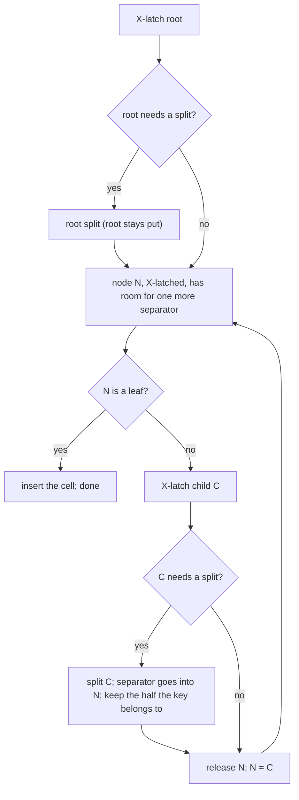

# 08 — B+Tree Indexes (`internal/btree`)

Status: **Designed for all of Phase 3; each part is implemented in its step (3.1 node format, key encoding, search; 3.2 insert; 3.3 delete; 3.4 range scans; 3.5 concurrency, WAL, crash safety). Implemented so far: 3.1, 3.2.** Written and approved under the standing autonomous-mode instruction.

The whole phase is designed in one document because its parts constrain each other: how splits and merges are done (3.2, 3.3) is dictated by how they must be latched and logged (3.5).

## 1. Problem

A heap finds a row only by its RID. An index maps a **key** (bytes built from column values) to a small **value** (typically a RID), and supports point lookups and ordered range scans in O(log n) page reads.

The tree must:

- order keys correctly, so encoded column values must sort as bytes the way the values themselves sort;
- stay balanced under any sequence of inserts and deletes;
- allow concurrent readers and writers;
- after a crash, contain exactly the effects of the operations whose log records were durable, each either complete or absent, with no structural damage.

## 2. Design

### 2.1 Keys: memcomparable encoding (Step 3.1)

`AppendNull`, `AppendBool`, `AppendInt64`, `AppendFloat64`, `AppendBytes` and `AppendString` append typed values to a key so that comparing two keys with `bytes.Compare` gives the same answer as comparing the values one column at a time:

| value | encoding |
|---|---|
| NULL | tag `0x05` (NULL sorts after every non-NULL value, as PostgreSQL's default `NULLS LAST`) |
| `false` / `true` | tag `0x01`, then `0x00` / `0x01` |
| int64 | tag `0x02`, then 8 bytes big-endian with the sign bit flipped |
| float64 | tag `0x03`, then 8 bytes: if the sign bit is set, all bits inverted, else the sign bit flipped. `-0` is stored as `+0` (they are equal); every NaN as one canonical NaN, which sorts after `+Inf` (PostgreSQL's rule). |
| bytes / text | tag `0x04`, then the bytes with each `0x00` written as `0x00 0xFF`, then the terminator `0x00 0x01` |

A column always holds one type, so the tags only order NULL against values and make keys self-describing. The terminator and escape make a shorter string sort before every longer string that starts with it, so composite keys compare field by field. Text compares by bytes (C collation). `DecodeKey` reverses the encoding; it rejects anything that is not exactly a sequence of valid fields, including non-canonical floats (`-0`, other NaNs), so every key has exactly one encoding.

The tree itself treats keys as opaque byte strings and **keys are unique** within a tree. A non-unique SQL index will make its keys unique by appending the RID (Phase 4).

### 2.2 Nodes (Step 3.1)

Every node is one page. The page type in the page header says leaf (`PageTypeBTreeLeaf`) or internal (`PageTypeBTreeInternal`). Both share one layout: a node header, a slot array of 2-byte offsets **kept in key order**, and variable-length cells packed from the end of the page down (layout in section 3).

- A **leaf** cell holds a key and a value.
- An **internal** node with *n* cells has *n + 1* children. `Child0` (in the node header) holds keys below the first cell's key, and cell *i*'s child holds keys from cell *i*'s key up to the next cell's key. So a lookup for *k* follows the child of the last cell whose key is ≤ *k*, or `Child0` if there is none.
- Search within a node is a binary search over the slot array.
- Every accessor checks the offsets it follows against the page, so a corrupt node yields `ErrCorruptNode`, never a panic. Every byte that is not header, slot or cell is zero (deleted cells and slots are scrubbed, compaction zeroes what it frees), so the result of any sequence of operations is fully determined by the operations, which redo relies on.
- Inserting at position *i* writes the cell into the free gap and shifts the slot array. Deleting removes the slot and scrubs the cell's bytes. When the gap is too small but total free space suffices, the node is compacted (cells slid to the end, as in slotted pages).
- **Limits:** keys up to 1024 bytes, values up to 512 bytes. A full-size leaf cell takes 1542 bytes including its slot, so any node holds at least five of them. A split of a full node therefore leaves room for any new cell in either half.

`Level` (0 for leaves) is stored in the node header. It lets validation prove that every leaf is at the same depth.

### 2.3 The root never moves

A tree is identified by its **root page ID**, which never changes, so whatever refers to the tree (the catalog, later) never has to be updated.

- **Root split:** the root's cells are divided into two new pages, and the root page is rewritten as an internal node with those two as children.
- **Root collapse:** when an internal root is left with no keys (a single child), the child's content is copied into the root page and the child is freed.

This needs no meta page and no new page type.

### 2.4 Insert: top-down, split before descending (Step 3.2)

- An internal node "needs a split" if it lacks room for a maximum-size internal cell, the most a child split can push into it. A leaf needs a split if the new cell does not fit.
- Splitting before descending means a split never propagates upward. A writer only ever holds two latches (parent and child, three pages when one is new), and the tree is consistent after every split.
- A node is split at the first cell where the left part holds at least half of the node's bytes. For a leaf the separator is the right half's first key; for an internal node it is the middle key, which moves up and becomes the new node's `Child0` boundary.
- `Insert` of an existing key fails with `ErrKeyExists`, after checking at the leaf; any splits made on the way down are kept, which is harmless.
- A split first builds the new contents of every page it changes in scratch buffers and only then copies them in, so a split that fails (no free frame for the new page, a corrupt node) changes nothing; in an unlogged tree the pages it allocated are freed again.
- A split can leave the right half underfull when one large cell dominates the node (the left half takes at least half of the bytes). Underflow is soft (2.8), so this is allowed and reported by `Check`.

### 2.5 Delete: latch crabbing, repair bottom-up (Step 3.3)

1. Descend with exclusive latches, keeping the latches of the path above the current node only while the current node is **unsafe**. A node is unsafe if removing the largest cell a child repair could take from it (or, at the leaf, the cell being deleted) would leave it **underfull**, below a quarter of the node's space. Once a node is safe, the latches above it are released.
2. Delete the cell at the leaf (`found=false` if the key is absent).
3. Walking back up the held path, repair each underfull non-root node X with a sibling S (the left one if X has one, else the right) under their parent P:
   - **Merge** if X, S (and, for internal nodes, the separator that comes down from P) fit in one node. The right node's content goes into the left node, the separator is removed from P, and the right page is freed (see 2.7).
   - Otherwise **redistribute**: move cells from S to X one at a time until X is no longer underfull or another move would make S underfull, then replace the separator in P. Redistribution is skipped if the new separator would not fit in P. Underflow is a soft condition (2.8), so the node simply stays a little underfull.
4. If the root is internal and has no keys left, collapse it (2.3).

Each repair step leaves a valid tree, so it can be its own log record.

### 2.6 Lookups and range scans (Steps 3.1, 3.4)

- `Get` descends with shared latches, coupling them: latch the child before releasing the parent.
- `Scan(start, end)` returns an iterator. Bounds may be inclusive, exclusive or unbounded. The iterator holds **no latch or pin between calls**. Each time it needs entries, it descends to the leaf that holds the smallest key past its position, copies every in-range entry of that leaf under the shared latch, and returns them one by one. When they run out, it descends again from the root, looking for keys after the last one returned.
  - So keys come back strictly increasing, never twice, and the iterator cannot follow a pointer to a page that a concurrent merge has made stale. This is why leaves have **no sibling links**: re-descending is what makes scans safe without holding latches between calls, and without links, splits and merges have fewer pages to change and log.
  - The cost is one root-to-leaf descent per leaf, not per row.
  - A scan sees each leaf as it was when it copied it. There is no snapshot across leaves; that is MVCC, Phase 6.

### 2.7 Freeing pages

Merges and root collapses unlink a page.

- **Unlogged tree:** the page is freed at once, through `BufferPool.DeletePage`.
- **Logged tree:** freeing is a data-file operation that is durable at once and not logged. If the page were freed before the record that unlinks it is durable, a crash would leave the tree pointing at a free page. So the tree calls `Logger.DeferFree(page, lsn)`, and **the checkpointer frees the page only once the checkpoint's redo point is past `lsn`**, after the control file is written. No record that touches the page can then ever be replayed.
- A crash loses the list of pages waiting to be freed, which leaks them (never corrupts anything).
- Pages allocated by a split whose record never became durable also leak, as in heaps.

### 2.8 Invariants and `Check`

`Tree.Check` validates the whole tree and returns statistics (height, node and key counts).

Hard invariants (checked):
- every page is a valid node of the right type;
- levels decrease by one per step down, and all leaves are at level 0;
- keys within a node are strictly increasing;
- every key in a child lies within the bounds its parent's separators give it;
- slot and cell bounds are valid, and no cells overlap.

Soft invariant (reported, not an error): underfull nodes. A crash between a leaf delete and its repair, or a skipped redistribution, can leave one.

An internal node with zero keys (one child) is valid. It can be left by a crash between a merge and the next repair, and lookups follow `Child0`.

### 2.9 Concurrency (Step 3.5)

- **Latch order:** always top-down, and among siblings left to right.
- Readers hold at most two shared latches (coupling). Inserters hold at most two exclusive latches plus a new page. Deleters hold the unsafe part of the path plus at most one sibling.
- Readers never move sideways, so a writer that holds a parent exclusively and latches a child's sibling cannot deadlock with them.
- Scans hold nothing between calls.
- A page freed by a merge is unreachable once the parent's exclusive latch is released. No reader can be on it, because readers enter children only while coupled to the parent.

### 2.10 Logging (Step 3.5)

The same approach as heaps (07-checkpoints-recovery.md): a new WAL record type `3`, one record per change, and a list of page blocks per record.

- **Leaf insert / leaf delete:** a physiological block (position, key and value; the delete carries the key so redo can check it). As with heaps, it becomes a full image if the page's LSN is below the redo point.
- **Every structural change** (split, root split, merge, redistribution, root collapse): one record holding **full images of every page it changed**, after the change. Structural changes are rare compared with leaf changes, and images make their redo trivial and obviously correct.

Changes are made under exclusive latches. The pages are marked dirty and copied for rollback first; the record is appended; then every page is stamped with its LSN. If logging fails, every page is restored and pages allocated for a split are leaked, not freed.

Redo installs images unconditionally and applies leaf operations only if the page's LSN is below the record's, checking the position, the ordering and (for deletes) the key.

The wal engine gains `CreateBTree` and `OpenBTree`, replays type-3 records, and lets the checkpointer free deferred pages.

## 3. Formats

All integers little-endian. Page header (24 bytes) as in 02-page-format.md, with `PageType` 4 (internal) or 5 (leaf).

Node layout (8192 bytes):

| offset | size | field | notes |
|---|---|---|---|
| 0 | 24 | page header | |
| 24 | 2 | NumCells | |
| 26 | 2 | Upper | offset of the lowest cell byte; 8192 when empty |
| 28 | 2 | Level | 0 for a leaf |
| 30 | 2 | reserved | zero |
| 32 | 8 | Child0 | internal: leftmost child; leaf: zero |
| 40 | 8 | reserved | zero |
| 48 | 2 × NumCells | slot array | cell offsets, in key order |
| … | | free space | |
| Upper | | cells | packed toward the end of the page |

Leaf cell: u16 KeyLen, u16 ValueLen, key, value. Internal cell: u16 KeyLen, u64 Child, key.

Limits: `MaxKeySize` 1024, `MaxValueSize` 512. Node space after the header: 8144 bytes. Underfull: fewer than 2036 bytes used (a quarter).

**B+Tree WAL record payload** (type 3):

| offset | size | field |
|---|---|---|
| 0 | 1 | BlockCount (1–8) |
| 1 | … | blocks |

Block: u64 PageID, u8 Kind, then:
- **1 image:** 8192 bytes.
- **2 leaf insert:** u16 index, u16 key length, u16 value length, key, value.
- **3 leaf delete:** u16 index, u16 key length, key.

## 4. Concurrency

See 2.9. The tree has no tree-wide lock: all coordination is through page latches. The free-space-like state of a heap does not exist here. The only shared in-memory state is the logger's deferred-free list, which has its own mutex.

## 5. Failure and crash behaviour

| Event | Result |
|---|---|
| Crash before an insert's or delete's leaf record is durable | The key is in its previous state. Durable splits or repairs that preceded it remain, and are harmless. |
| Crash after it is durable | Present after recovery. |
| Crash in the middle of a structural change | The change is one record, so all or nothing. |
| Torn node page | Rebuilt from the image logged since the redo point. |
| Crash between a leaf delete and its repair | An underfull node, which is valid. |
| Logging fails | The operation fails with its pages restored; allocated pages leak; the log is failed, so the engine must be reopened. |
| Pages waiting to be freed at a crash | Leak. |
| Corrupt node read from disk (bad checksum or bad structure) | Error (`ErrCorruptNode`), never a panic. |

## 6. Alternatives considered

- **A meta page holding the root ID.** Needs a new page type, and every root change becomes a two-page change. The fixed root is simpler.
- **Leaf sibling links for scans.** Faster per leaf, but a scan holding nothing between calls could follow a link into a page a concurrent merge just emptied, and every split and merge would have one more page to change and log. Re-descending per leaf is O(log n) extra per leaf, about 1/100th of a descent per row.
- **B-link trees (Lehman–Yao).** Fewer latches, but subtle, and they need right links and high keys. Not needed at this scale.
- **Bottom-up splits with crabbing for inserts.** Multi-level splits would need one record spanning many pages, or a sequence of records with an inconsistent tree in between. Splitting before descending gives one 3-page record per split.
- **Preemptive merging for deletes.** With variable-length keys, a "rich enough" test has to assume a maximum-size cell, which merges nodes far too eagerly. Crabbing touches only what actually underflows.
- **Physiological logging of splits and merges.** Smaller records but many more redo paths to get right. Images are obviously correct.
- **Freeing merged pages immediately in a logged tree.** Unsafe across a crash (2.7).
- **Suffix truncation and prefix compression.** Real space wins, deferred until benchmarks motivate them.

## 7. Testing plan

- **Keys (3.1):** for random typed values and composite keys, `bytes.Compare` of the encodings must equal the value comparison. Plus edge values (min/max ints, ±0, ±Inf, NaN, empty and `0x00`-laden strings, prefixes), golden bytes, round trip through `DecodeKey`, and `FuzzDecodeKey`.
- **Nodes (3.1):** insert and delete at every position, compaction, exact capacity with maximum-size cells, `Validate` rejecting each kind of corruption, `FuzzNode` (arbitrary page bytes never panic; a page that validates stays valid under any operation). Lookups on hand-built trees.
- **Insert (3.2) and delete (3.3):** model-based tests against a sorted model, with random key and value sizes (including maximum sizes), random small pools (constant eviction), `Check` after every structural change, plus root split, root collapse, deep trees, sequential and reverse-sequential insert orders, and delete-everything / reinsert cycles. **Millions of operations in total** (more under `make crashtest`).
- **Scans (3.4):** every bound combination, against the model; empty ranges; bounds between, equal to, before and after keys; scans interleaved with writes.
- **Concurrency (3.5):** writers on disjoint and overlapping keys with readers and scanners, under `-race`; scans must be strictly increasing with no duplicates; a final `Check` and a model comparison.
- **WAL (3.5):** the image rule; replay equals reality, including onto torn pages from the redo point; logging failure restores pages; deferred frees happen only after the redo point passes; the crash harness in `tests/crash` gains B+Tree operations, checked against the model after every crash.
- **Benchmarks:** insert, point lookup, scan.

## 8. Limitations

- Keys must be unique; non-unique indexes append the RID (Phase 4).
- Text compares by bytes (C collation); no descending-order columns yet.
- No suffix truncation, prefix compression, or bulk loading.
- Scans are per-leaf consistent, not snapshots.
- Pages leak if a crash loses the deferred-free list, or happens between allocating and logging a split.
- Redistribution may leave a node a little underfull when the new separator does not fit.
