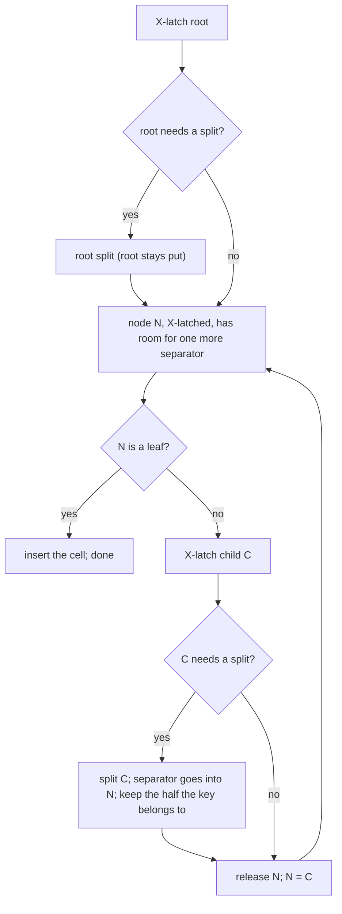

# 08 — B+Tree Indexes (`internal/btree`)

Status: **Designed for all of Phase 3; each part is implemented in its step (3.1 node format, key encoding, search; 3.2 insert; 3.3 delete; 3.4 range scans; 3.5 concurrency, WAL, crash safety). All of it is implemented.** Written and approved under the standing autonomous-mode instruction.

**Revision 2 (review after Phase 4), designed, awaiting approval, not yet implemented:** a reserved Flags byte in leaf cells (2.2, 3) and the Phase 6 interaction it prepares for (2.11); deferred frees that survive crashes (2.7, 3) and a scavenger on the roadmap; a corrected deadlock-freedom argument (2.9) with a test aimed at left-sibling repairs (7); Phase 4 notes (2.12); new limitations (8).

The whole phase is designed in one document because its parts constrain each other: how splits and merges are done (3.2, 3.3) is dictated by how they must be latched and logged (3.5).

## 1. Problem

A heap finds a row only by its RID. An index maps a **key** (bytes built from column values) to a small **value** (typically a RID), and supports point lookups and ordered range scans in O(log n) page reads.

The tree must:

- order keys correctly, so encoded column values must sort as bytes the way the values themselves sort;
- stay balanced under any sequence of inserts and deletes;
- allow concurrent readers and writers;
- after a crash, contain exactly the effects of the operations whose log records were durable, each either complete or absent, with no structural damage.

## 2. Design

### 2.1 Keys: memcomparable encoding (Step 3.1)

`AppendNull`, `AppendBool`, `AppendInt64`, `AppendFloat64`, `AppendBytes` and `AppendString` append typed values to a key so that comparing two keys with `bytes.Compare` gives the same answer as comparing the values one column at a time:

| value | encoding |
|---|---|
| NULL | tag `0x05` (NULL sorts after every non-NULL value, as PostgreSQL's default `NULLS LAST`) |
| `false` / `true` | tag `0x01`, then `0x00` / `0x01` |
| int64 | tag `0x02`, then 8 bytes big-endian with the sign bit flipped |
| float64 | tag `0x03`, then 8 bytes: if the sign bit is set, all bits inverted, else the sign bit flipped. `-0` is stored as `+0` (they are equal); every NaN as one canonical NaN, which sorts after `+Inf` (PostgreSQL's rule). |
| bytes / text | tag `0x04`, then the bytes with each `0x00` written as `0x00 0xFF`, then the terminator `0x00 0x01` |

A column always holds one type, so the tags only order NULL against values and make keys self-describing. The terminator and escape make a shorter string sort before every longer string that starts with it, so composite keys compare field by field. Text compares by bytes (C collation). `DecodeKey` reverses the encoding; it rejects anything that is not exactly a sequence of valid fields, including non-canonical floats (`-0`, other NaNs), so every key has exactly one encoding.

The tree itself treats keys as opaque byte strings and **keys are unique** within a tree. A non-unique SQL index will make its keys unique by appending the RID (Phase 4).

### 2.2 Nodes (Step 3.1)

Every node is one page. The page type in the page header says leaf (`PageTypeBTreeLeaf`) or internal (`PageTypeBTreeInternal`). Both share one layout: a node header, a slot array of 2-byte offsets **kept in key order**, and variable-length cells packed from the end of the page down (layout in section 3).

- A **leaf** cell holds a key, a value and a one-byte **Flags** field. Flags is always zero until Phase 6, which uses bit 0 to delete-mark an entry (2.11); it exists now so that MVCC needs no change to the node format. Until then a leaf cell with non-zero Flags is corrupt (`ErrCorruptNode`), so nothing can silently misread a page written by a later format.
- An **internal** node with *n* cells has *n + 1* children. `Child0` (in the node header) holds keys below the first cell's key, and cell *i*'s child holds keys from cell *i*'s key up to the next cell's key. So a lookup for *k* follows the child of the last cell whose key is ≤ *k*, or `Child0` if there is none.
- Search within a node is a binary search over the slot array.
- Every accessor checks the offsets it follows against the page, so a corrupt node yields `ErrCorruptNode`, never a panic. Every byte that is not header, slot or cell is zero (deleted cells and slots are scrubbed, compaction zeroes what it frees), so the result of any sequence of operations is fully determined by the operations, which redo relies on.
- Inserting at position *i* writes the cell into the free gap and shifts the slot array. Deleting removes the slot and scrubs the cell's bytes. When the gap is too small but total free space suffices, the node is compacted (cells slid to the end, as in slotted pages).
- **Limits:** keys up to 1024 bytes, values up to 512 bytes. A full-size leaf cell takes 1543 bytes including its slot (1542 before the Flags byte), so any node still holds at least five of them (7715 of 8144 bytes). A split of a full node therefore leaves room for any new cell in either half.

`Level` (0 for leaves) is stored in the node header. It lets validation prove that every leaf is at the same depth.

### 2.3 The root never moves

A tree is identified by its **root page ID**, which never changes, so whatever refers to the tree (the catalog, later) never has to be updated.

- **Root split:** the root's cells are divided into two new pages, and the root page is rewritten as an internal node with those two as children.
- **Root collapse:** when an internal root is left with no keys (a single child), the child's content is copied into the root page and the child is freed.

This needs no meta page and no new page type.

### 2.4 Insert: top-down, split before descending (Step 3.2)

- An internal node "needs a split" if it lacks room for a maximum-size internal cell, the most a child split can push into it. A leaf needs a split if the new cell does not fit.
- Splitting before descending means a split never propagates upward. A writer only ever holds two latches (parent and child, three pages when one is new), and the tree is consistent after every split.
- A node is split at the first cell where the left part holds at least half of the node's bytes. For a leaf the separator is the right half's first key; for an internal node it is the middle key, which moves up and becomes the new node's `Child0` boundary.
- `Insert` of an existing key fails with `ErrKeyExists`, after checking at the leaf; any splits made on the way down are kept, which is harmless.
- A split first builds the new contents of every page it changes in scratch buffers and only then copies them in, so a split that fails (no free frame for the new page, a corrupt node) changes nothing; in an unlogged tree the pages it allocated are freed again.
- A split can leave the right half underfull when one large cell dominates the node (the left half takes at least half of the bytes). Underflow is soft (2.8), so this is allowed and reported by `Check`.

### 2.5 Delete: latch crabbing, repair bottom-up (Step 3.3)

1. Descend with exclusive latches, keeping the latches of the path above the current node only while the current node is **unsafe**. A node is unsafe if removing the largest cell a child repair could take from it (or, at the leaf, the cell being deleted) would leave it **underfull**, below a quarter of the node's space. Once a node is safe, the latches above it are released.
2. Delete the cell at the leaf (`found=false` if the key is absent).
3. Walking back up the held path, repair each underfull non-root node X with a sibling S (the left one if X has one, else the right) under their parent P:
   - **Merge** if X, S (and, for internal nodes, the separator that comes down from P) fit in one node. The right node's content goes into the left node, the separator is removed from P, and the right page is freed (see 2.7).
   - Otherwise **redistribute**: move cells from S to X one at a time until X is no longer underfull or another move would make S underfull, then replace the separator in P. Redistribution is skipped if the new separator would not fit in P. Underflow is a soft condition (2.8), so the node simply stays a little underfull.
4. If the root is internal and has no keys left, collapse it (2.3).

Each repair step leaves a valid tree, so it can be its own log record.

Notes from the implementation:

- The walk up continues past a node that is not underfull: a node higher on the held path may be underfull from before (a crash, a skipped redistribution) and gets repaired opportunistically.
- A redistribution only happens when the two nodes do not fit in one, so the sibling holds more than three quarters of a node; filling the underfull node to a quarter cannot drain it. The check that a move would leave the sibling underfull is kept as a guard but is effectively unreachable.
- Merges and redistributions are built on scratch copies and copied in only when they are known to fit, so a failure changes nothing.
- In an unlogged tree a freed page is given back to the data file once nothing is latched. A reader coupled through the page may still hold its pin for an instant after releasing its latch, so freeing retries on `ErrPagePinned`.

### 2.6 Lookups and range scans (Steps 3.1, 3.4)

- `Get` descends with shared latches, coupling them: latch the child before releasing the parent.
- `Scan(start, end)` returns an iterator. Bounds may be inclusive, exclusive or unbounded. The iterator holds **no latch or pin between calls**. Each time it needs entries, it descends to the leaf that holds the smallest key past its position, copies every in-range entry of that leaf under the shared latch, and returns them one by one. When they run out, it descends again from the root, looking for keys after the last one returned.
  - So keys come back strictly increasing, never twice, and the iterator cannot follow a pointer to a page that a concurrent merge has made stale. This is why leaves have **no sibling links**: re-descending is what makes scans safe without holding latches between calls, and without links, splits and merges have fewer pages to change and log.
  - The cost is one root-to-leaf descent per leaf, not per row.
  - A scan sees each leaf as it was when it copied it. There is no snapshot across leaves; that is MVCC, Phase 6.
  - To find the next leaf without sibling links, the descent records the leaf's **upper fence**: the separator just right of the path at the deepest level that has one. Every key at or above the fence lies in a later leaf, so the next refill seeks the fence inclusively. A key present for the whole scan is always returned: when its leaf was copied, every key between the seek position and the fence was in that leaf. The rightmost leaf has no fence, which ends the scan.
  - The API is `Scan(start, end Bound)` with `Incl(key)`, `Excl(key)` and the zero `Bound` (unbounded); `Next(ctx)` returns copies. An error is sticky.

### 2.7 Freeing pages

Merges and root collapses unlink a page.

- **Unlogged tree:** the page is freed at once, through `BufferPool.DeletePage`.
- **Logged tree:** freeing is a data-file operation that is durable at once and not logged. If the page were freed before the record that unlinks it is durable, a crash would leave the tree pointing at a free page. So the tree calls `Logger.DeferFree(page, lsn)`, and **the checkpointer frees the page only once the checkpoint's redo point is past `lsn`**, after the control file is written. No record that touches the page can then ever be replayed.
- **The list of pages waiting to be freed survives crashes** (revision 2). It lives in memory as before, and every entry is also in the log:
  - `DeferFree` appends a **deferred-free record** (WAL type `6`, section 3) naming the page and the LSN after which it may be freed. For a B+Tree merge or root collapse it is appended right after the record that unlinked the page; inside a statement group it belongs to the group, so a discarded statement's entries are discarded with it. The executor's `DROP TABLE` and `DROP INDEX` log their pages the same way, inside their statement group, before the commit (10-executor.md section 2.5).
  - At a checkpoint with redo point *R*, entries with LSN < *R* are freed (after the control file is written, as before). Every other entry is **logged again** in deferred-free records appended after *R* and before the checkpoint record, keeping its original LSN, so that the log from *R* on names every entry still waiting.
  - Recovery rebuilds the list from the deferred-free records it replays (skipping those of discarded statement groups, and keeping one entry per page).
  - **Why this never frees a live page or frees one twice:** an entry freed by checkpoint *C* has LSN < *R_C*, its original record is before *R_C*, and so is every copy (copies are written before earlier checkpoints' records, which precede *C*'s redo point), and *C* writes no copy of it. Once *C*'s control file exists, recovery starts at *R_C* and never sees it again; before that, the page has not been freed yet. So a replayed entry always names a page that is still allocated and unreachable.
- **What can still leak:** a page unlinked by a record that became durable while its deferred-free record did not (a crash between the two), pages a checkpoint was freeing when it crashed (they were not logged again), and pages allocated for a split whose record never became durable, as in heaps. All are unreachable, never corrupt anything, and are what the scavenger (below) reclaims.
- **Roadmap: scavenger.** A pass that finds allocated pages reachable from nothing (no catalog heap, user heap, index tree, or pending free) and frees them. It walks every root the catalog knows (heap chains with `Heap.Pages`, trees with `Tree.Pages`), subtracts the pending list and the free list from the data file's allocated pages, and frees the rest. It must run with no statement open (allocation only happens inside statements), so the executor runs it under its exclusive lock, at open after recovery or on demand. Added to PROGRESS.md as a roadmap item.

### 2.8 Invariants and `Check`

`Tree.Check` validates the whole tree and returns statistics (height, node and key counts).

Hard invariants (checked):
- every page is a valid node of the right type;
- levels decrease by one per step down, and all leaves are at level 0;
- keys within a node are strictly increasing;
- every key in a child lies within the bounds its parent's separators give it;
- slot and cell bounds are valid, and no cells overlap.

Soft invariant (reported, not an error): underfull nodes. A crash between a leaf delete and its repair, or a skipped redistribution, can leave one.

An internal node with zero keys (one child) is valid. It can be left by a crash between a merge and the next repair, and lookups follow `Child0`.

### 2.9 Concurrency (Step 3.5)

- **Latch rules.** Every thread latches pages downward: the root first, then only a child of a page it holds (readers couple shared latches; writers hold exclusive ones). The one exception is a deleter's repair, which latches a **sibling** of a node it holds, and does so only while holding their common parent exclusively. Which sibling depends on position: the left one if the node has one, otherwise the right one. So **siblings are not latched left to right**: a repair of a non-first child latches its left sibling after the node itself. (The first version of this section claimed a left-to-right order; that was wrong.) A thread never latches a page again after releasing it, and a new page from a split is unreachable until the split is done.
- Readers hold at most two shared latches (coupling). Inserters hold at most two exclusive latches plus a new page. Deleters hold the unsafe part of the path plus at most one sibling.
- **Why there is no deadlock anyway.** Suppose thread T waits for page N, held by thread U. T holds N's parent: it is either descending into N or repairing a sibling of N, and in both cases it holds the parent (exclusively in the second). So U cannot hold N's parent too in a mode that would let it latch N's sibling (that needs the parent exclusively), and U, which latched N earlier through the parent and released it, never latches the parent again. Everything U can still ask for is therefore strictly below N: a child of the lowest page it holds, or a sibling of a page it holds below N under a parent it holds. T holds nothing below N (its pages are N's ancestors and, when repairing, N's sibling and the path under that sibling). So along any chain of waits, the depth of the requested page strictly increases, and the chain cannot close into a cycle. The argument does not depend on which sibling a repair takes.
- Readers never move sideways, and scans hold nothing between calls, so they only ever wait downward.
- Scans hold nothing between calls.
- A page freed by a merge is unreachable once the parent's exclusive latch is released. No reader can be on it, because readers enter children only while coupled to the parent.

### 2.10 Logging (Step 3.5)

The same approach as heaps (07-checkpoints-recovery.md): a new WAL record type `3`, one record per change, and a list of page blocks per record.

- **Leaf insert / leaf delete:** a physiological block (position, key and value; the delete carries the key so redo can check it). As with heaps, it becomes a full image if the page's LSN is below the redo point.
- **Every structural change** (split, root split, merge, redistribution, root collapse): one record holding **full images of every page it changed**, after the change. Structural changes are rare compared with leaf changes, and images make their redo trivial and obviously correct.

Changes are made under exclusive latches. The pages are marked dirty and copied for rollback first; the record is appended; then every page is stamped with its LSN. If logging fails, every page is restored and pages allocated for a split are leaked, not freed.

Redo installs images unconditionally and applies leaf operations only if the page's LSN is below the record's, checking the position, the ordering and (for deletes) the key.

The wal engine gains `CreateBTree` and `OpenBTree`, replays type-3 records, and lets the checkpointer free deferred pages.

Notes from the implementation:

- `btree.Logger` has two methods: `LogBTree(ctx, build)` (as heaps' `Log`, but the record is type 3) and `DeferFree(page, lsn)`. `wal.Logger` implements both.
- Every logged step goes through one small helper: `touch` marks a page dirty under its exclusive latch and keeps a copy, `commit` logs the record and stamps the LSN, or restores every copy if logging fails. Structural changes are built in scratch first and only then touched and copied in.
- A page allocated for a split whose record failed to log is leaked, never freed: the record may still reach the log. One allocated but never touched by a record (the change failed before logging) is freed at once, because nothing can name it.
- The checkpointer frees deferred pages after it writes the control file (step 6 of 07-checkpoints-recovery.md section 2.4). By then the log is durable through the checkpoint record, so the record that unlinked each page is durable too. A page still pinned for an instant, and the pages after a failed free, wait for the next checkpoint.

### 2.11 Phase 6 interaction: index entries under in-place updates and undo

Phase 6 brings MVCC without VACUUM: a row is updated **in place** in the heap, keeping its RID, and its old versions live in an **undo log**, from which a reader rebuilds the version its snapshot should see. Indexes fit in like this:

- **An update that changes no indexed column touches no index.** The RID is unchanged, so the entries still point at the row. (Unlike PostgreSQL, where every update writes a new row version and, unless HOT applies, a new entry in every index.)
- **An update that changes an indexed key** cannot remove the old entry at once: an older snapshot may still need to find the row by its old key. It **delete-marks** the old entry (Flags bit 0) and inserts an entry for the new key. A delete delete-marks the row's entries the same way. Both are logged; the undo record of the change names the entries it marked.
- **Readers** that reach an entry fetch the row, rebuild the version visible to their snapshot from the undo chain, and keep it only if that version's key still matches the entry (a recheck). A delete-marked entry is not skipped, because it may be exactly the entry an older snapshot needs; a live entry can likewise lead to a version that does not match and is dropped.
- **Rollback** applies the undo: it removes entries the transaction inserted and clears the marks it set.
- **Cleanup without VACUUM.** When the transaction that marked an entry is older than every running snapshot, the entry is removed physically by the **undo purge**, the same incremental process that trims the undo log. It knows exactly which entries to remove from the undo records, so the work is proportional to the changes made, done in the background in small steps, never by scanning a table or index. That is the no-VACUUM goal applied to indexes: no dead entries accumulate beyond the oldest snapshot, and nothing has to sweep the tree to find them.
- **Open question for Phase 6: unique indexes.** Phase 4's unique indexes use the key alone as the tree key (2.12). Under MVCC a delete-marked entry and a live entry for the same key, from two different rows, can coexist, which a key-alone layout cannot hold. Phase 6 will either key every index entry by key + RID and enforce uniqueness with a prefix probe, or let an insert reuse a delete-marked entry of the same key when that is safe. The first changes what keys a unique index stores, not the node format; deciding it before data exists would avoid a migration.

### 2.12 Phase 4 notes: how SQL indexes use the tree

- **NULLs in unique indexes.** A unique index's tree key is the indexed columns alone, so a second equal key is found by a lookup. NULLs are never equal to each other, so when any key column is NULL the RID is appended and any number of such rows coexist, as with PostgreSQL's default `NULLS DISTINCT`. `NULLS NOT DISTINCT` is not supported.
- **Key-size limits apply to the encoded key.** The 1024-byte limit is on the encoded bytes: each column adds a tag, text adds a 2-byte terminator and doubles every `0x00` byte, and a non-unique index (or a unique one with a NULL) adds 18 bytes of RID. So the longest text value a single-column index accepts is 1021 bytes in a unique index and 1003 in a non-unique one, less if it contains zero bytes, and less again for composite keys. A longer key fails with `54000`. PostgreSQL's B-tree limit is about 2704 bytes per entry, so some values PostgreSQL indexes are refused here.
- **Collation.** Text keys compare by bytes, which is PostgreSQL's `C` collation. A PostgreSQL database created with a typical default locale (`en_US.UTF-8`) orders text differently: case-insensitively first and with accents folded, so `'B' < 'a'` holds here and in `COLLATE "C"`, but not there. `ORDER BY`, range predicates and index order on text therefore match PostgreSQL only under the C collation.

## 3. Formats

All integers little-endian. Page header (24 bytes) as in 02-page-format.md, with `PageType` 4 (internal) or 5 (leaf).

Node layout (8192 bytes):

| offset | size | field | notes |
|---|---|---|---|
| 0 | 24 | page header | |
| 24 | 2 | NumCells | |
| 26 | 2 | Upper | offset of the lowest cell byte; 8192 when empty |
| 28 | 2 | Level | 0 for a leaf |
| 30 | 2 | reserved | zero |
| 32 | 8 | Child0 | internal: leftmost child; leaf: zero |
| 40 | 8 | reserved | zero |
| 48 | 2 × NumCells | slot array | cell offsets, in key order |
| … | | free space | |
| Upper | | cells | packed toward the end of the page |

Leaf cell: u16 KeyLen, u16 ValueLen, u8 Flags, key, value (revision 2; before it, the cell had no Flags byte). Flags is zero; bit 0 will be Phase 6's delete mark; any other value is `ErrCorruptNode`. Internal cell: u16 KeyLen, u64 Child, key.

Because leaf cells change, the data file's `FormatVersion` goes from 1 to 2, so a file written before revision 2 is refused with `ErrUnsupportedVersion` instead of being misread. (No data from earlier versions needs to be kept.) The WAL leaf-insert and leaf-delete blocks are unchanged: an inserted entry always has Flags zero, and Phase 6 will add a block kind to set flags.

Limits: `MaxKeySize` 1024, `MaxValueSize` 512. Node space after the header: 8144 bytes. Underfull: fewer than 2036 bytes used (a quarter).

**B+Tree WAL record payload** (type 3):

| offset | size | field |
|---|---|---|
| 0 | 1 | BlockCount (1–8) |
| 1 | … | blocks |

Block: u64 PageID, u8 Kind, then:
- **1 image:** 8192 bytes.
- **2 leaf insert:** u16 index, u16 key length, u16 value length, key, value.
- **3 leaf delete:** u16 index, u16 key length, key.

**Deferred-free record payload** (WAL type 6, revision 2): u32 Count (1 or more), then Count entries of u64 PageID and u64 LSN. LSN 0 means the record's own LSN. A record holds at most 65,535 entries; a longer list takes several records. Recovery treats an entry naming page 0 or 1, or a malformed payload, as `ErrCorrupt`.

## 4. Concurrency

See 2.9. The tree has no tree-wide lock: all coordination is through page latches. The free-space-like state of a heap does not exist here. The only shared in-memory state is the logger's deferred-free list, which has its own mutex.

## 5. Failure and crash behaviour

| Event | Result |
|---|---|
| Crash before an insert's or delete's leaf record is durable | The key is in its previous state. Durable splits or repairs that preceded it remain, and are harmless. |
| Crash after it is durable | Present after recovery. |
| Crash in the middle of a structural change | The change is one record, so all or nothing. |
| Torn node page | Rebuilt from the image logged since the redo point. |
| Crash between a leaf delete and its repair | An underfull node, which is valid. |
| Logging fails | The operation fails with its pages restored; allocated pages leak; the log is failed, so the engine must be reopened. |
| Pages waiting to be freed at a crash | Rebuilt from the deferred-free records and freed by a later checkpoint (2.7). Only the narrow windows listed in 2.7 leak, for the scavenger. |
| Corrupt node read from disk (bad checksum or bad structure) | Error (`ErrCorruptNode`), never a panic. |

## 6. Alternatives considered

- **A meta page holding the root ID.** Needs a new page type, and every root change becomes a two-page change. The fixed root is simpler.
- **Leaf sibling links for scans.** Faster per leaf, but a scan holding nothing between calls could follow a link into a page a concurrent merge just emptied, and every split and merge would have one more page to change and log. Re-descending per leaf is O(log n) extra per leaf, about 1/100th of a descent per row.
- **B-link trees (Lehman–Yao).** Fewer latches, but subtle, and they need right links and high keys. Not needed at this scale.
- **Bottom-up splits with crabbing for inserts.** Multi-level splits would need one record spanning many pages, or a sequence of records with an inconsistent tree in between. Splitting before descending gives one 3-page record per split.
- **Preemptive merging for deletes.** With variable-length keys, a "rich enough" test has to assume a maximum-size cell, which merges nodes far too eagerly. Crabbing touches only what actually underflows.
- **Physiological logging of splits and merges.** Smaller records but many more redo paths to get right. Images are obviously correct.
- **Freeing merged pages immediately in a logged tree.** Unsafe across a crash (2.7).
- **Carrying the pending list in the checkpoint record instead of logging it again.** Equivalent, but changes the checkpoint record's format and needs a size limit on one record; re-logging uses the deferred-free record already needed for new entries.
- **Logging "page freed" after each free, and re-logging every entry.** Closes the leak window during a checkpoint's free pass, but a crash between a free and its record leaves a free page on the list, which could by then have been allocated again. Leaking that page instead is safe, and the scavenger reclaims it.
- **Deriving frees from merge records during redo.** Covers merges but not dropped tables, and needs a new block kind; one deferred-free record serves both.
- **Suffix truncation and prefix compression.** Real space wins, deferred until benchmarks motivate them.

## 7. Testing plan

- **Keys (3.1):** for random typed values and composite keys, `bytes.Compare` of the encodings must equal the value comparison. Plus edge values (min/max ints, ±0, ±Inf, NaN, empty and `0x00`-laden strings, prefixes), golden bytes, round trip through `DecodeKey`, and `FuzzDecodeKey`.
- **Nodes (3.1):** insert and delete at every position, compaction, exact capacity with maximum-size cells, `Validate` rejecting each kind of corruption, `FuzzNode` (arbitrary page bytes never panic; a page that validates stays valid under any operation). Lookups on hand-built trees.
- **Insert (3.2) and delete (3.3):** model-based tests against a sorted model, with random key and value sizes (including maximum sizes), random small pools (constant eviction), `Check` after every structural change, plus root split, root collapse, deep trees, sequential and reverse-sequential insert orders, and delete-everything / reinsert cycles. **Millions of operations in total** (more under `make crashtest`).
- **Scans (3.4):** every bound combination, against the model; empty ranges; bounds between, equal to, before and after keys; scans interleaved with writes.
- **Concurrency (3.5):** writers on disjoint and overlapping keys with readers and scanners, under `-race`; scans must be strictly increasing with no duplicates; a final `Check` and a model comparison.
- **WAL (3.5):** the image rule; replay equals reality, including onto torn pages from the redo point; logging failure restores pages; deferred frees happen only after the redo point passes; the crash harness in `tests/crash` gains B+Tree operations, checked against the model after every crash.
- **Revision 2.** Flags: a leaf cell's Flags byte round-trips, is zero in everything written, and a non-zero value is rejected by every accessor and by `Check`; capacity with maximum-size cells is still five per node; a data file with format version 1 is refused. Deferred frees: after merges and a crash, recovery rebuilds exactly the pending list, and a later checkpoint frees those pages (the data file's free count grows by them); repeated crashes at every point of a checkpoint never free a page twice or free a page that is reachable (checked by walking every tree and heap after each recovery); a dropped table's pages are freed after a crash; deferred-free records of a discarded statement are ignored; malformed records are `ErrCorrupt`; the crash harness gains a "no reachable page is ever on the free list, and leaked pages stay within the windows of 2.7" check. Concurrency: a test aimed at **left-sibling repairs** (deletes that empty right-hand children so they repair with their left sibling) running with inserters into those left siblings, readers and scanners, under `-race`, with a watchdog that fails the test and dumps goroutines if it stalls; counters split repairs by sibling side and the test requires many concurrent left-sibling merges and redistributions; final `Check` and model comparison.
- **Benchmarks:** insert, point lookup, scan.

Benchmarks (Step 3.5; `go test -bench . ./internal/btree/`, 4-core 2.1 GHz Xeon, a pool large enough to hold the tree, 16-byte keys and 8-byte values, 100,000 entries for lookups and scans):

| benchmark | time | allocations |
|---|---|---|
| Insert, random keys, unlogged | 2.1 µs | 8 |
| Insert, sequential keys, unlogged | 2.1 µs | 9 |
| Insert, random keys, logged (in-memory log) | 5.1 µs | 18 |
| Insert, sequential keys, logged | 4.2 µs | 19 |
| Get | 1.2 µs | 4 |
| Get, 4 goroutines | 2.1 µs | 4 |
| Scan, per entry | 83 ns | 2 |
| Delete then re-insert, logged | 11.8 µs | 28 |

## 8. Limitations

- Keys must be unique; non-unique indexes append the RID (Phase 4).
- Text compares by bytes (C collation); no descending-order columns yet.
- No suffix truncation, prefix compression, or bulk loading.
- Scans are per-leaf consistent, not snapshots.
- Pages leak in the narrow crash windows of 2.7 (and between allocating and logging a split) until the scavenger exists.
- **Full-page images in the WAL.** Every structural change logs full images of the pages it changes, and the first change to any page after a checkpoint logs its full image (torn-page protection, 07-checkpoints-recovery.md). This is the WAL volume PostgreSQL suffers from (WORKFLOW.md problem #8), so NoVacDB does **not** fix problem #8 yet, and it must stay open until smaller change-only records with another form of torn-page protection replace these images.
- **Every writer exclusively latches the root.** Inserts and deletes start with an exclusive latch on the root and keep it until the next node down is safe, so writers to different parts of the tree serialise briefly at the root. The future fix is **optimistic descent**: descend with shared latches, take the leaf exclusively, and restart pessimistically only when the leaf would split or underflow.
- Redistribution may leave a node a little underfull when the new separator does not fit.
- Point lookups do not scale across cores yet: every page pin takes the buffer pool's single mutex (see the parallel `Get` benchmark). A sharded page table would fix it.
- A logged change copies each page it touches (8 KiB) for rollback, which dominates the cost of a logged insert.
