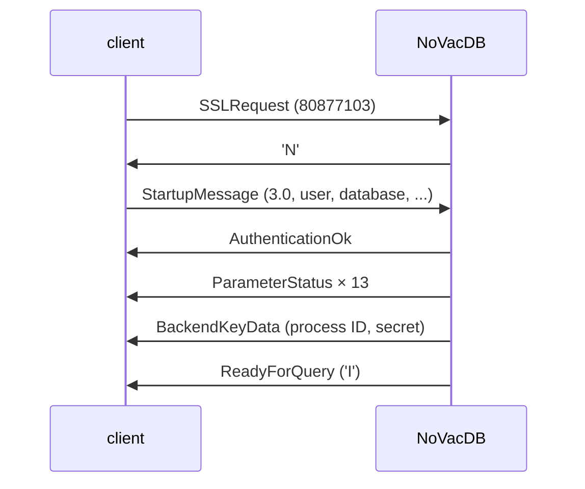

# 12 — PostgreSQL Wire Protocol (`internal/pgwire`, `internal/server`)

Status: **Designed for Phase 5 (Steps 5.1–5.4); awaiting review.** Step 5.1 (startup and authentication) is designed in full here. Steps 5.2–5.4 are outlined in section 2.6 so that 5.1's choices fit them, and are detailed in this document when their step starts.

## 1. Problem

NoVacDB must speak PostgreSQL's frontend/backend protocol, version 3.0, so that `psql`, `pgbench` and standard drivers connect without special support. Step 5.1 covers everything from TCP connect to the first `ReadyForQuery`: TLS and GSS encryption requests (declined), the startup message and its parameters, authentication (trust), the session parameters the server reports, and the cancel key.

It must also be robust: a client is untrusted input. A malformed, oversized, slow or abandoned connection must cost a bounded amount of memory and time, end with a clear error, and never crash the server or affect other connections.

## 2. Design

### 2.1 Layers

- **`internal/pgwire`**: the protocol's messages, with no networking or database knowledge. A `Reader` reads framed messages from an `io.Reader` with a size limit; a `Writer` builds backend messages into a buffer and flushes them. Pure functions decode the startup packet and encode each backend message. Everything here is testable on byte slices and fuzzable.
- **`internal/server`**: `Server` accepts TCP connections, runs one goroutine per connection, performs the startup handshake, and (from 5.2) hands queries to `executor.DB`. It owns connection IDs and cancel keys, timeouts, and shutdown.
- **`cmd/novacdb`**: opens the database in `--data-dir` on the real file system (`vfs.OSFS`), starts the server on `--listen` (default `localhost`) and `--port` (default 5433), and stops on SIGINT/SIGTERM (graceful shutdown is completed in 5.4).

### 2.2 Framing

All integers big-endian (the protocol's byte order; the storage engine's little-endian rule is about NoVacDB's own files).

- **Startup-phase packets** have no type byte: `Int32 length` (including itself) then `Int32 code`, then a body. Length must be at least 8 and at most **10,000 bytes** (PostgreSQL's `MAX_STARTUP_PACKET_LENGTH`).
- **Regular messages**: `Byte1 type`, `Int32 length` (including itself, not the type), body. Length must be at least 4 and at most **`MaxMessageSize` = 16 MiB**. PostgreSQL allows up to 1 GiB, but NoVacDB's queries are at most 1 MiB (09-sql-frontend.md) and rows at most a page, so 16 MiB leaves room for parameters (5.3) while bounding what a client can make the server allocate. A larger length is a protocol violation.
- A length outside its bounds, or a message whose body does not parse exactly (missing terminators, trailing bytes), is **`08P01` protocol_violation**: the server sends a `FATAL` `ErrorResponse` and closes the connection, as PostgreSQL does. It never reads the declared body of an oversized message.

### 2.3 Startup (Step 5.1)

The first packet's code decides what it is:

| code | packet | server action |
|---|---|---|
| 80877103 | `SSLRequest` | Reply `N` (no TLS) and read the next startup packet. |
| 80877104 | `GSSENCRequest` | Reply `N` and read the next startup packet. |
| 80877102 | `CancelRequest` | Step 5.4. In 5.1, close the connection without a reply (a cancel request never gets one). |
| major 3 (`0x0003xxxx`) | `StartupMessage` | Continue below. |
| anything else | | `FATAL 0A000` "unsupported frontend protocol *M.m*: server supports 3.0 to 3.0", close. |

At most two encryption requests (one of each kind) are accepted before the startup message; a third, or one after the other was declined twice, is `08P01`. A client that sends data after its `SSLRequest` but before reading the `N` is a protocol violation in PostgreSQL (it may be a TLS downgrade attack); NoVacDB does the same: if bytes are already buffered after an encryption request, `08P01`.

**StartupMessage.** After the code: name/value pairs of NUL-terminated strings, ended by an empty name. Duplicates: the last one wins, as in PostgreSQL.

- **Protocol minor version.** NoVacDB speaks 3.0. A client asking for 3.*n* with *n* > 0 (`psql` 18 asks for 3.2) gets a `NegotiateProtocolVersion` message (`v`: newest minor supported, 0, and the list of `_pq_.`-prefixed options it did not recognise), and the session continues in 3.0. Any `_pq_.` option is likewise listed and ignored, even with 3.0.
- **`user`** is required: missing or empty is `FATAL 28000` "no PostgreSQL user name specified in startup packet".
- **`database`** defaults to the user name. NoVacDB has one database per data directory, so **any database name is accepted** (decision: rejecting names would make plain `psql -h localhost -p 5433` fail, since `psql` asks for a database named after the OS user). The name is kept for the session and logged.
- **`application_name`**: kept, reported back, and logged. At most 63 bytes (PostgreSQL truncates; so does NoVacDB).
- **`client_encoding`**: `UTF8` (any case, with or without the hyphen, or `UNICODE`) is accepted. Anything else is `FATAL 22023` `invalid value for parameter "client_encoding": "LATIN1"`: NoVacDB stores and sends only UTF-8, and has no conversions.
- **`DateStyle`**: accepted if it is ISO output (`ISO`, `ISO, MDY`, `ISO, DMY`, `ISO, YMD`, any case and spacing); reported as `ISO, MDY`. Otherwise `FATAL 22023`.
- **`TimeZone`**: accepted if it names UTC (`UTC`, `Etc/UTC`, `GMT`, `Etc/GMT`, `Z`, `+00`, `0`); anything else is `FATAL 0A000` "time zone "Europe/Berlin" is not supported yet: the session time zone is always UTC" (10-executor.md section 8). Drivers that send the JVM's time zone (pgjdbc) need `-Duser.timezone=UTC` until time zones arrive.
- **`extra_float_digits`**: accepted (any integer −15..3) and ignored: NoVacDB always prints the shortest exact form, which is what PostgreSQL prints for values ≥ 1, the default since PostgreSQL 12.
- **`search_path`**, **`statement_timeout`** and **`lock_timeout`**: accepted and ignored with a log line (no schemas yet; timeouts arrive with transactions). Ignoring them silently changes nothing a client can observe today.
- **`options`**: the command-line form `-c name=value` and `--name=value`, split on unescaped spaces with backslash escapes as libpq does; each setting goes through the same rules.
- **`replication`**: `FATAL 0A000` "replication is not supported".
- **Anything else**: `FATAL 42704` `unrecognized configuration parameter "foo"`, as PostgreSQL.

**Authentication: trust.** After the startup message the server sends `AuthenticationOk` (`R`, 0). There is no password check. Because of that, **the server listens on `localhost` by default**, as PostgreSQL does, and logs a warning at startup when `--listen` names a non-loopback address. Password authentication (SCRAM-SHA-256) is on the roadmap before any network deployment; it needs only the `R` subcodes 10–12 and the SASL exchange, which this framing already supports.

**ParameterStatus** (`S`), the 13 parameters PostgreSQL 16 reports, in its order:

| name | value |
|---|---|
| `application_name` | from the startup message, or empty |
| `client_encoding` | `UTF8` |
| `DateStyle` | `ISO, MDY` |
| `default_transaction_read_only` | `off` |
| `in_hot_standby` | `off` |
| `integer_datetimes` | `on` |
| `IntervalStyle` | `postgres` |
| `is_superuser` | `on` |
| `server_encoding` | `UTF8` |
| `server_version` | `16.0 (NoVacDB 0.5)` |
| `session_authorization` | the user |
| `standard_conforming_strings` | `on` |
| `TimeZone` | `UTC` |

`server_version` starts with 16.0 because drivers parse its leading number to decide which SQL they may send (libpq's `PQserverVersion`, pgx, pgjdbc), and NoVacDB's SQL follows PostgreSQL 16; the parenthesised part says what it really is. `psql` 16 therefore connects without its version-mismatch warning.

**BackendKeyData** (`K`): a 32-bit process ID and a 32-bit secret. NoVacDB has no processes, so the "process ID" is a connection number, starting at a random value and increasing (never 0); the secret comes from `crypto/rand`. The server keeps the pair while the connection is open, so 5.4's `CancelRequest` can find it. Under protocol 3.0 the key is exactly 4 bytes (3.2's longer keys come with 3.2).

**ReadyForQuery** (`Z`, `I`): the session is idle. Step 5.1 ends here.

### 2.4 After startup, in Step 5.1

Only `Terminate` (`X`) is fully handled: the server closes the connection. A `Query` (`Q`) gets an `ERROR 0A000` "the simple query protocol is not implemented yet" followed by `ReadyForQuery`, so `psql` stays usable and reports it, until 5.2 replaces it. Any other message type is `FATAL 08P01` "invalid frontend message type *N*" and the connection closes, as PostgreSQL does for unknown types.

### 2.5 Errors and notices

`ErrorResponse` (`E`) and `NoticeResponse` (`N`) carry fields: `S` severity (`ERROR`, `FATAL`, `NOTICE`), `V` the same, unlocalised (PostgreSQL 9.6+), `C` SQLSTATE, `M` message, and when present `D` detail, `H` hint, `P` position (1-based characters, as `sqlerr.Error` already holds). A `FATAL` error ends the connection after it is sent. Errors of the executor are `*sqlerr.Error` already, so 5.2 maps them field by field.

### 2.6 Steps 5.2–5.4, in outline

- **5.2 Simple query.** `Query` runs `executor.DB.Exec` statement by statement: `RowDescription` (column names, type OIDs: `int4` 23, `int8` 20, `float8` 701, `text` 25, `bool` 16, `timestamptz` 1184; text format), `DataRow`s in the text output form, `CommandComplete` with the tag, `NoticeResponse` for notices, `EmptyQueryResponse` for an empty string, then `ReadyForQuery`. An error stops the rest of the string, as PostgreSQL's implicit transaction does (except that earlier statements stay committed: 10-executor.md section 5). Rows are streamed in batches rather than built whole (needs an executor cursor API; designed in 5.2).
- **5.3 Extended query.** `Parse`/`Bind`/`Describe`/`Execute`/`Sync`/`Close`/`Flush`, named and unnamed statements and portals, text-format parameters (`$1` binds as an untyped literal of the parameter's declared or inferred type), binary result formats for the six types. Errors skip to `Sync`.
- **5.4 Connections.** A connection limit (`--max-connections`, default 1000: goroutines are cheap; problem #12/#13 in WORKFLOW.md), `CancelRequest` (cancels the target connection's statement context; a cancelled write that has begun applying still finishes, 10-executor.md section 2.4), idle and startup timeouts, and graceful shutdown: stop accepting, let running statements finish up to a deadline, send `FATAL 57P01` "terminating connection due to administrator command", close the database (final checkpoint).

## 3. Formats

Messages exactly as in PostgreSQL's documentation, chapter 55.7 (protocol 3.0). Step 5.1 sends `R` (AuthenticationOk, 9 bytes: `R`, length 8, 0), `S`, `K`, `Z`, `E`, `N`, `v`, and the single byte `N` for declined encryption; it reads the startup packets of section 2.3 and the type-byte messages `X` and `Q`. Nothing is stored on disk.

## 4. Concurrency

One goroutine per connection, plus the accept loop. Connections share only the `executor.DB` (safe for concurrent use: 10-executor.md section 2.6) and the server's table of cancel keys (a mutex-protected map). Each connection reads and writes its own socket; writes are buffered and flushed at `ReadyForQuery` and before blocking reads, so a query's messages go out in few system calls.

## 5. Failure behaviour

| Event | Result |
|---|---|
| Startup packet too short, too long, or malformed | `FATAL 08P01`, close. |
| Startup not finished within 60 s (PostgreSQL's `authentication_timeout`) | Close without a message. |
| Unsupported protocol version | `FATAL 0A000`, close. |
| Unknown or invalid startup parameter | `FATAL 42704` / `22023` / `0A000`, close. |
| Client closes or the network fails at any point | The connection's goroutine ends and releases its cancel key; the server and other connections are unaffected. |
| A message longer than 16 MiB | `FATAL 08P01` before reading its body, close. |
| Unknown message type | `FATAL 08P01`, close. |
| Panic while serving a connection (a bug) | Recovered in that goroutine, logged with the stack, `FATAL XX000` sent if possible, connection closed. The server keeps running. |
| The database cannot be opened at startup | The process exits with an error before listening. |

## 6. Alternatives considered

- **TLS now.** Declining `SSLRequest` is valid protocol, and every client falls back unless told `sslmode=require`. TLS needs certificate configuration and is not what the MVP is about; the framing allows adding it (reply `S` and wrap the connection) without other changes.
- **Rejecting unknown database names.** PostgreSQL does, but NoVacDB has one database; refusing names would break `psql` with default arguments for no benefit. A later multi-database design can start refusing.
- **Ignoring unknown startup parameters.** Friendlier, but a client that asked for a setting would believe it applied. NoVacDB follows PostgreSQL and refuses, except for the few listed in 2.3 whose effect is nil or impossible to observe today.
- **`server_version` "0.5".** Honest, but drivers would conclude it is PostgreSQL 0.5 and either refuse to connect or fall back to ancient SQL.
- **A third-party protocol library.** Ruled out by the zero-dependency rule, and the protocol is small.

## 7. Testing plan (Step 5.1)

- **Codec:** every backend message's bytes against hand-written golden bytes; the startup decoder on valid packets with every parameter, and on every truncation, missing terminator, trailing byte, bad length and duplicate; `FuzzStartup` (no panic, and any accepted packet re-encodes to the same parameters) and `FuzzMessageReader` (arbitrary bytes never make it allocate more than the limit or panic).
- **Handshake, over real loopback TCP against an in-process server:** plain startup; `SSLRequest` then startup; `GSSENCRequest` then `SSLRequest` then startup; a third encryption request; data pipelined after `SSLRequest`; protocol 2.0, 4.0 and 3.2 (`NegotiateProtocolVersion` listing `_pq_.` options); missing user; database defaulting to the user; each parameter rule of 2.3 including `options`; the exact sequence and values of `ParameterStatus`; distinct cancel keys across connections; `Terminate`; a `Query` before 5.2; an unknown message type; an oversized message (rejected without reading its body); a client that stalls during startup (closed after the timeout, made short in tests); abrupt disconnects at every byte of the handshake; many concurrent handshakes under `-race`.
- **A real client:** `psql -h localhost -p 5433 -c ''`-style connection check in an integration test that runs only when `psql` is installed (it is in CI's image and here), plus the manual steps in the step's notes.
- **Command:** `novacdb` starts, listens, logs its address, and exits cleanly on SIGTERM.

## 8. Limitations

- Trust authentication only: anyone who can reach the port is in. Hence `localhost` by default.
- No TLS or GSS encryption.
- Protocol 3.0 only (3.2's features, such as longer cancel keys, are negotiated away).
- One database per data directory; the database name in the startup message is not checked.
- UTF-8 only; session time zone UTC only; date style ISO only.
