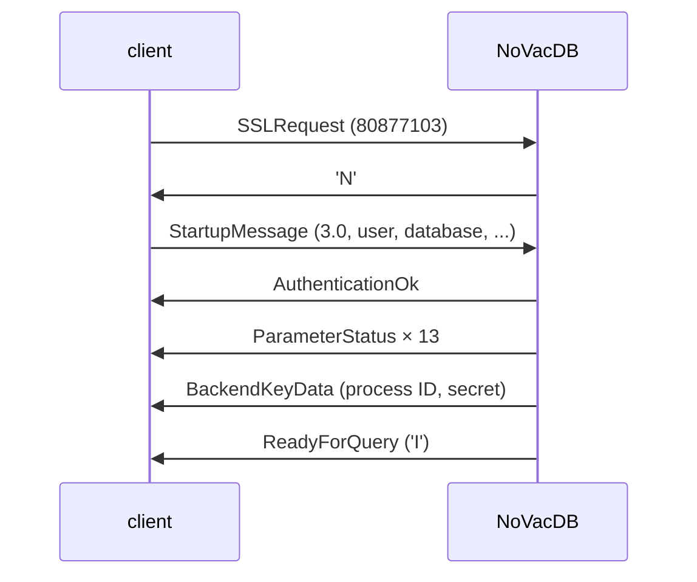
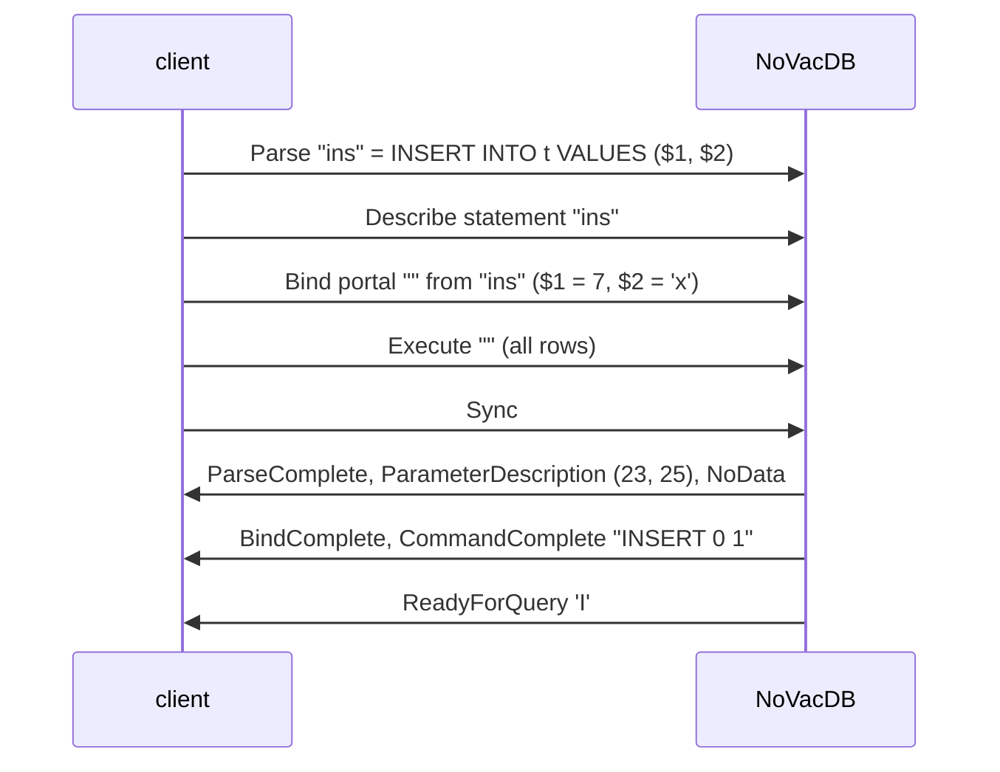

# 12 — PostgreSQL Wire Protocol (`internal/pgwire`, `internal/server`)

Status: **Designed for Phase 5 (Steps 5.1–5.4); approved. Implemented: 5.1–5.4 (Phase 5 complete).** Step 5.1 (startup and authentication) was designed in full first; Steps 5.2–5.4 were outlined in section 2.6 so that 5.1's choices fit them, and are detailed in sections 2.8 (5.2), 2.10 (5.3) and 2.12 (5.4), each followed by its implementation notes.

## 1. Problem

NoVacDB must speak PostgreSQL's frontend/backend protocol, version 3.0, so that `psql`, `pgbench` and standard drivers connect without special support. Step 5.1 covers everything from TCP connect to the first `ReadyForQuery`: TLS and GSS encryption requests (declined), the startup message and its parameters, authentication (trust), the session parameters the server reports, and the cancel key.

It must also be robust: a client is untrusted input. A malformed, oversized, slow or abandoned connection must cost a bounded amount of memory and time, end with a clear error, and never crash the server or affect other connections.

## 2. Design

### 2.1 Layers

- **`internal/pgwire`**: the protocol's messages, with no networking or database knowledge. A `Reader` reads framed messages from an `io.Reader` with a size limit; a `Writer` builds backend messages into a buffer and flushes them. Pure functions decode the startup packet and encode each backend message. Everything here is testable on byte slices and fuzzable.
- **`internal/server`**: `Server` accepts TCP connections, runs one goroutine per connection, performs the startup handshake, and (from 5.2) hands queries to `executor.DB`. It owns connection IDs and cancel keys, timeouts, and shutdown.
- **`cmd/novacdb`**: opens the database in `--data-dir` on the real file system (`vfs.OSFS`), starts the server on `--listen` (default `localhost`) and `--port` (default 5433), and stops on SIGINT/SIGTERM (graceful shutdown is completed in 5.4).

### 2.2 Framing

All integers big-endian (the protocol's byte order; the storage engine's little-endian rule is about NoVacDB's own files).

- **Startup-phase packets** have no type byte: `Int32 length` (including itself) then `Int32 code`, then a body. Length must be at least 8 and at most **10,000 bytes** (PostgreSQL's `MAX_STARTUP_PACKET_LENGTH`).
- **Regular messages**: `Byte1 type`, `Int32 length` (including itself, not the type), body. Length must be at least 4 and at most **`MaxMessageSize` = 16 MiB**. PostgreSQL allows up to 1 GiB, but NoVacDB's queries are at most 1 MiB (09-sql-frontend.md) and rows at most a page, so 16 MiB leaves room for parameters (5.3) while bounding what a client can make the server allocate. A larger length is a protocol violation.
- A length outside its bounds, or a message whose body does not parse exactly (missing terminators, trailing bytes), is **`08P01` protocol_violation**: the server sends a `FATAL` `ErrorResponse` and closes the connection, as PostgreSQL does. It never reads the declared body of an oversized message.

### 2.3 Startup (Step 5.1)



The first packet's code decides what it is:

| code | packet | server action |
|---|---|---|
| 80877103 | `SSLRequest` | Reply `N` (no TLS) and read the next startup packet. |
| 80877104 | `GSSENCRequest` | Reply `N` and read the next startup packet. |
| 80877102 | `CancelRequest` | Step 5.4. In 5.1, close the connection without a reply (a cancel request never gets one). |
| major 3 (`0x0003xxxx`) | `StartupMessage` | Continue below. |
| anything else | | `FATAL 0A000` "unsupported frontend protocol *M.m*: server supports 3.0 to 3.0", close. |

At most two encryption requests (one of each kind) are accepted before the startup message; a third, or one after the other was declined twice, is `08P01`. A client that sends data after its `SSLRequest` but before reading the `N` is a protocol violation in PostgreSQL (it may be a TLS downgrade attack); NoVacDB does the same: if bytes are already buffered after an encryption request, `08P01`.

**StartupMessage.** After the code: name/value pairs of NUL-terminated strings, ended by an empty name. Duplicates: the last one wins, as in PostgreSQL.

- **Protocol minor version.** NoVacDB speaks 3.0. A client asking for 3.*n* with *n* > 0 (`psql` 18 asks for 3.2) gets a `NegotiateProtocolVersion` message (`v`: newest minor supported, 0, and the list of `_pq_.`-prefixed options it did not recognise), and the session continues in 3.0. Any `_pq_.` option is likewise listed and ignored, even with 3.0.
- **`user`** is required: missing or empty is `FATAL 28000` "no PostgreSQL user name specified in startup packet".
- **`database`** defaults to the user name. NoVacDB has one database per data directory, so **any database name is accepted** (decision: rejecting names would make plain `psql -h localhost -p 5433` fail, since `psql` asks for a database named after the OS user). The name is kept for the session and logged.
- **`application_name`**: kept, reported back, and logged. At most 63 bytes (PostgreSQL truncates; so does NoVacDB).
- **`client_encoding`**: `UTF8` (any case, with or without the hyphen, or `UNICODE`) is accepted, and so is `SQL_ASCII`, which PostgreSQL also accepts with a UTF-8 server: it means "no conversion", and libpq sends it from terminals in the C locale (found while implementing: refusing it would stop `psql` from connecting there). Anything else is `FATAL 22023` `invalid value for parameter "client_encoding": "LATIN1"`: NoVacDB stores and sends only UTF-8, and has no conversions.
- **`DateStyle`**: accepted if it is ISO output (`ISO`, `ISO, MDY`, `ISO, DMY`, `ISO, YMD`, any case and spacing); reported as `ISO, MDY`. Otherwise `FATAL 22023`.
- **`TimeZone`**: accepted if it names UTC (`UTC`, `Etc/UTC`, `GMT`, `Etc/GMT`, `Z`, `+00`, `0`); anything else is `FATAL 0A000` "time zone "Europe/Berlin" is not supported yet: the session time zone is always UTC" (10-executor.md section 8). Drivers that send the JVM's time zone (pgjdbc) need `-Duser.timezone=UTC` until time zones arrive.
- **`extra_float_digits`**: accepted (any integer −15..3) and ignored: NoVacDB always prints the shortest exact form, which is what PostgreSQL prints for values ≥ 1, the default since PostgreSQL 12.
- **`search_path`**, **`statement_timeout`** and **`lock_timeout`**: accepted and ignored with a log line (no schemas yet; timeouts arrive with transactions). Ignoring them silently changes nothing a client can observe today.
- **`options`**: the command-line form `-c name=value` and `--name=value`, split on unescaped spaces with backslash escapes as libpq does; each setting goes through the same rules.
- **`replication`**: `FATAL 0A000` "replication is not supported".
- **Anything else**: `FATAL 42704` `unrecognized configuration parameter "foo"`, as PostgreSQL.

**Authentication: trust.** After the startup message the server sends `AuthenticationOk` (`R`, 0). There is no password check. Because of that, **the server listens on `localhost` by default**, as PostgreSQL does, and logs a warning at startup when `--listen` names a non-loopback address. Password authentication (SCRAM-SHA-256) is on the roadmap before any network deployment; it needs only the `R` subcodes 10–12 and the SASL exchange, which this framing already supports.

**ParameterStatus** (`S`), the 13 parameters PostgreSQL 16 reports, in its order:

| name | value |
|---|---|
| `application_name` | from the startup message, or empty |
| `client_encoding` | `UTF8` |
| `DateStyle` | `ISO, MDY` |
| `default_transaction_read_only` | `off` |
| `in_hot_standby` | `off` |
| `integer_datetimes` | `on` |
| `IntervalStyle` | `postgres` |
| `is_superuser` | `on` |
| `server_encoding` | `UTF8` |
| `server_version` | `16.0 (NoVacDB 0.5)` |
| `session_authorization` | the user |
| `standard_conforming_strings` | `on` |
| `TimeZone` | `UTC` |

`server_version` starts with 16.0 because drivers parse its leading number to decide which SQL they may send (libpq's `PQserverVersion`, pgx, pgjdbc), and NoVacDB's SQL follows PostgreSQL 16; the parenthesised part says what it really is. `psql` 16 therefore connects without its version-mismatch warning.

**BackendKeyData** (`K`): a 32-bit process ID and a 32-bit secret. NoVacDB has no processes, so the "process ID" is a connection number, starting at a random value and increasing (never 0); the secret comes from `crypto/rand`. The server keeps the pair while the connection is open, so 5.4's `CancelRequest` can find it. Under protocol 3.0 the key is exactly 4 bytes (3.2's longer keys come with 3.2).

**ReadyForQuery** (`Z`, `I`): the session is idle. Step 5.1 ends here.

### 2.4 After startup, in Step 5.1

(Replaced by section 2.8 in Step 5.2.) Only `Terminate` (`X`) is fully handled: the server closes the connection. A `Query` (`Q`) gets an `ERROR 0A000` "the simple query protocol is not implemented yet" followed by `ReadyForQuery`, so `psql` stays usable and reports it, until 5.2 replaces it. Any other message type is `FATAL 08P01` "invalid frontend message type *N*" and the connection closes, as PostgreSQL does for unknown types.

### 2.5 Errors and notices

`ErrorResponse` (`E`) and `NoticeResponse` (`N`) carry fields: `S` severity (`ERROR`, `FATAL`, `NOTICE`), `V` the same, unlocalised (PostgreSQL 9.6+), `C` SQLSTATE, `M` message, and when present `D` detail, `H` hint, `P` position (1-based characters, as `sqlerr.Error` already holds). A `FATAL` error ends the connection after it is sent. Errors of the executor are `*sqlerr.Error` already, so 5.2 maps them field by field.

### 2.6 Steps 5.2–5.4, in outline

- **5.2 Simple query.** Designed in 2.8.
- **5.3 Extended query.** `Parse`/`Bind`/`Describe`/`Execute`/`Sync`/`Close`/`Flush`, named and unnamed statements and portals, text-format parameters (`$1` binds as an untyped literal of the parameter's declared or inferred type), binary result formats for the six types. Errors skip to `Sync`. Designed in 2.10.
- **5.4 Connections.** A connection limit (`--max-connections`, default 1000: goroutines are cheap; problem #12/#13 in WORKFLOW.md), `CancelRequest` (cancels the target connection's statement context; a cancelled write that has begun applying still finishes, 10-executor.md section 2.4), idle and startup timeouts, and graceful shutdown: stop accepting, let running statements finish up to a deadline, send `FATAL 57P01` "terminating connection due to administrator command", close the database (final checkpoint). Designed in 2.12.

### 2.7 Implementation notes (Step 5.1)

- **`SQL_ASCII` client encoding** is accepted (2.3), a change from the reviewed design: libpq sends it from terminals in the C locale, and PostgreSQL accepts it.
- **Large message bodies grow as they arrive.** A body up to 64 KiB is allocated at once; a larger one is read into a buffer that grows with the bytes received, so announcing 16 MiB and stalling costs nothing.
- **Startup errors come before `AuthenticationOk`.** PostgreSQL checks startup settings after authentication; with trust authentication the difference is invisible to clients, and refusing early sends less.
- **The cancel request code is protocol "1234.5678".** A version check that looked only at the major number would treat it as protocol 1234; the startup loop recognises the three request codes first, so the tests' "unsupported protocol" cases use 1234.5677.
- **Verified with real clients:** `psql` 16 connects (with `sslmode=prefer`, after the declined `SSLRequest`), shows the 5.1 query error, and `\conninfo` reports the database and user; `pg_isready` reports "accepting connections"; a refused `TimeZone` setting is shown as the server's `FATAL`; the server stops cleanly on SIGTERM. An integration test runs `psql` whenever it is installed.

### 2.8 Simple query protocol (Step 5.2)

A `Query` message carries a string of zero or more statements. The server runs it with `executor.DB.Exec`, which runs the statements in order and stops at the first error, and answers:

```mermaid
sequenceDiagram
    participant C as client
    participant S as NoVacDB
    C->>S: Query "CREATE ...; INSERT ...; SELECT ..."
    S->>C: CommandComplete "CREATE TABLE"
    S->>C: CommandComplete "INSERT 0 2"
    S->>C: RowDescription, DataRow × n, CommandComplete "SELECT n"
    S->>C: ReadyForQuery 'I'
```

- **For each statement that ran:** its notices as `NoticeResponse` (severity `NOTICE`, with the notice's SQLSTATE: `42P07` for "relation ... already exists, skipping", `00000` for "... does not exist, skipping", as PostgreSQL), then, for a `SELECT`, `RowDescription` and one `DataRow` per row, then `CommandComplete` with the command tag.
- **If a statement failed:** `ErrorResponse` (severity `ERROR`, with the code, message, detail, hint and position the executor reports; the position counts characters in the whole query string, as PostgreSQL's does). The statements after it do not run. The statements before it stay committed (10-executor.md section 5: there are no transactions yet, so this is where NoVacDB differs from PostgreSQL's implicit transaction around a multi-statement string).
- **An empty string** (nothing but whitespace, comments and semicolons) gets `EmptyQueryResponse`.
- **Then `ReadyForQuery`** with status `I` (idle): with no transactions, the session is always idle between queries.

**RowDescription** describes each column as PostgreSQL does for a computed column: name, table OID 0, attribute number 0, the type's OID and size, type modifier −1, and format 0 (text).

| type | OID | size |
|---|---|---|
| `integer` | 23 (`int4`) | 4 |
| `bigint` | 20 (`int8`) | 8 |
| `double precision` | 701 (`float8`) | 8 |
| `text` | 25 (`text`) | −1 |
| `boolean` | 16 (`bool`) | 1 |
| `timestamptz` | 1184 (`timestamptz`) | 8 |

(PostgreSQL reports the source table and column for plain column references; clients use them only for updatable result sets, which nothing here supports. Zero is valid and means "not a column".)

**DataRow** values are the text output forms of 10-executor.md section 2.1, exactly what `psql` prints (`t`/`f`, `2024-01-02 03:04:05+00`, shortest-exact doubles); NULL is length −1.

**Results are built whole, then sent.** The executor builds a statement's rows before returning them (10-executor.md section 8), and the read lock is released before any byte goes to the client, so a slow client never holds up writers. Sending streams the built rows through the connection's buffer, flushing every 64 KiB, so the protocol side adds no second copy of a large result. Streaming rows from the executor (a cursor API) waits for Phase 7, where large results become common.

**Context.** Each query runs with a context that is cancelled when the server shuts down; Step 5.4's `CancelRequest` will cancel it too. A client that disconnects is noticed when the server next writes or reads.

**Other messages, until Step 5.3** (which replaced this with 2.10)**:** the extended-protocol messages (`Parse`, `Bind`, `Describe`, `Execute`, `Close`, `Flush`) get one `ERROR 0A000` "the extended query protocol is not implemented yet", after which the server discards messages until `Sync` and then sends `ReadyForQuery`, exactly as PostgreSQL recovers from an error in an extended-protocol sequence; `Sync` alone gets `ReadyForQuery`. `FunctionCall` gets `ERROR 0A000` and `ReadyForQuery`. `CopyData`, `CopyDone` and `CopyFail` outside a COPY are ignored, as PostgreSQL does. Anything else is `FATAL 08P01` as in 5.1.

**What does not work yet, and why it is not hidden:** `BEGIN`, `COMMIT`, `SET`, `SHOW` and queries on `pg_catalog` (which `psql`'s `\d` commands send) are syntax or unknown-table errors until transactions (Phase 6) and catalog compatibility (Phase 9). They fail with PostgreSQL's error codes, so clients report them clearly.

### 2.9 Implementation notes (Step 5.2)

- **Notices carry their SQLSTATE.** The executor's notices became `{Code, Message}` pairs (`42P07` for "already exists, skipping", `00000` for "does not exist, skipping"), so `NoticeResponse` has the same `C` field as PostgreSQL's.
- **`SELECT FROM t` (an empty select list) is a result.** PostgreSQL sends a `RowDescription` of no columns and one empty `DataRow` per row, and `psql` prints `--` and `(n rows)`. The executor returned no column list for it, which the server took for a statement without rows; every `SELECT` result now has a non-nil column list, empty or not.
- **At most 1664 output columns.** `RowDescription` and `DataRow` count columns in 16 bits, so a select list of 70,000 entries corrupted the stream (found by trying it with `psql`). The executor now refuses more than 1664, PostgreSQL's limit, with `54011` "target lists can have at most 1664 entries" at the first target past the limit; `*` counts every column it expands to.
- **Wide rows.** Trying a 1000-column table for the limit above found a crash from Step 4.3: encoding a row of more than 488 columns made its first buffer with a capacity smaller than its length. Fixed, with a round-trip test of rows up to 1600 columns.
- **`Config.DB` is required.** `server.New` refuses a nil database; tests use an in-memory one.
- **The SQL logic tests run over the wire too.** The runner works through a `Session` interface; besides the executor directly, every test file now runs through a server on loopback TCP with a small protocol client in the test code, so all 250 records check what the protocol carries.
- **Verified with real `psql` 16:** creating, filling, querying, updating and deleting; aligned output of every type and NULL; errors with `LINE 1:` and the caret under the position; notices; several `-c` commands; `SELECT FROM t`; the column limit; a clean stop on SIGTERM. An integration test runs these through `psql` whenever it is installed.

### 2.10 Extended query protocol (Step 5.3)

The extended protocol splits a statement's life into messages, so that a driver can prepare a statement once and run it many times with parameters, and ask for binary values.



**In the executor: `Prepare` and `ExecPrepared`.** `DB.Prepare(ctx, sql, declared)` parses one statement (more than one is `42601` "cannot insert multiple commands into a prepared statement", none is an empty statement) and binds it against the catalog without running it. Each `$N` binds to a parameter node whose type is what was declared, or else is inferred from the context exactly as an untyped literal's would be (10-executor.md section 2.1): `id = $1` makes `$1` an integer when `id` is one, `INSERT` takes the column's type, `LIMIT $1` a bigint, `$1 || 'x'` text. A parameter nothing decides (`SELECT $1`, `$1 IS NULL`) is text. The result is a `Prepared`: the parameter types and, for a `SELECT`, the result columns. `DB.ExecPrepared(ctx, p, values)` binds the statement again with each parameter as a constant of its type and runs it as `Exec` would, so a parameter is a constant to the planner (an index is used for `id = $1`). If the tables changed since `Prepare` so that a `SELECT` would return other columns, it is `0A000` "cached plan must not change result type", as in PostgreSQL: a client decodes rows by the description it was given. Binding again on each run (no cached plans) keeps every run correct after any DDL, at the cost of a bind per run, which is small next to the scan.

**Messages:**

| Message | Answer | Errors |
|---|---|---|
| `Parse` name, query, parameter types | `ParseComplete` | `42P05` if a named statement exists (the unnamed one is replaced); the statement's own errors; `0A000` for a declared type OID that is not supported |
| `Bind` portal, statement, formats, values, result formats | `BindComplete` | `26000` no such statement; `42P03` named portal exists; `08P01` wrong number of values, or of result formats (0, 1 or one per column are allowed); `22023` format code not 0 or 1; the value's input error (`22P02`, `22003`, `22P03` bad binary, `22021` bad UTF-8 or NUL) |
| `Describe` statement | `ParameterDescription`, then `RowDescription` (text formats) or `NoData` | `26000` |
| `Describe` portal | `RowDescription` with the portal's formats, or `NoData` | `34000` |
| `Execute` portal, row limit | rows, then `CommandComplete`, or `PortalSuspended` when the limit stopped it; `EmptyQueryResponse` for an empty statement | `34000`; the statement's errors; `55000` "portal cannot be run" for a non-`SELECT` portal run twice |
| `Close` statement or portal | `CloseComplete` (also when it does not exist) | — |
| `Flush` | writes what is buffered | — |
| `Sync` | `ReadyForQuery` | — |

After an error, messages are discarded up to `Sync`, which answers `ReadyForQuery`; a malformed `Parse`, `Bind`, `Describe`, `Execute` or `Close` body is such an error (`08P01`), as in PostgreSQL, not a `FATAL`. Without transactions, `Sync` ends the implicit transaction by dropping every portal (named statements stay), and a simple `Query` does the same and also drops the unnamed statement, as PostgreSQL does.

**Portals and row limits.** A portal runs at its first `Execute`, building its whole result as a simple query does (2.8); the rows are kept in the portal and handed out over as many `Execute`s as the client's row limits need, each ending with `PortalSuspended` until the last, whose `CommandComplete` counts the rows of that `Execute` (as PostgreSQL's does). An `Execute` of a finished `SELECT` portal returns no rows and `SELECT 0`.

**Types and formats.** `ParameterDescription` and `RowDescription` use the OIDs of 2.8. A client may declare a parameter as one of the six types, as 0 or `unknown` (705) for "infer it", or as `smallint` (21), `real` (700) or `varchar` (1043), which become integer, double precision and text (they hold every value of those types exactly); their OID is reported back as declared, and decides the binary form the value is read in. Any other OID is refused at `Parse`. Values in text format are read with the type's input function; text must be valid UTF-8 without NUL bytes. Binary formats are PostgreSQL's send/receive formats: big-endian two's complement integers of 2, 4 or 8 bytes, IEEE 754 floats of 4 or 8 bytes, a boolean byte (any non-zero is true), text as its UTF-8 bytes, and `timestamptz` as microseconds since 2000-01-01 UTC in 8 bytes, with PostgreSQL's infinity values; a binary timestamp outside years 1 to 10000 is `22008`. Results are sent in the formats `Bind` asked for, per column.

**Output.** Answers are buffered and written when the server would otherwise wait for input, so a pipeline's answers go out together; `Flush` writes at once, and any buffer past 64 KiB is written as it grows.

### 2.11 Implementation notes (Step 5.3)

- **Parameter inference reuses the untyped-literal rules.** While preparing, a parameter node reports type `unknown` until the binder coerces it, which records the type for every occurrence. A later occurrence sees the recorded type, so `id = $1 AND $1 = true` is the operator error PostgreSQL also gives. Preparing binds under the shared lock and stops before anything is read or changed; DDL is not bound at all (PostgreSQL does not analyse utility statements at `Parse` either), so a `$1` in a `CREATE TABLE` default is "there is no parameter $1" when it runs.
- **Statements with `$N` in a simple query** stay an error (`42P02`), as in PostgreSQL.
- **Counts are unsigned.** PostgreSQL reads the protocol's 16-bit counts as unsigned, so a statement can have 65535 parameters; the lexer already refuses `$65536`.
- **A batch is not atomic.** Drivers send a batch as many statements before one `Sync`; PostgreSQL runs them in one implicit transaction, so an error rolls back the batch. Until transactions (Phase 6), each statement commits as it runs, as each statement of a multi-statement simple query does (2.8).
- **Fuzzing the session.** A contained panic would answer `FATAL XX000` and keep the server up, which could hide a bug from ordinary tests; `FuzzSession` sends arbitrary bytes, as messages, to a real session after a setup, and fails on any `XX000`, any logged panic, any hang, or an unreadable answer. A planted panic was caught by its seeds. `FuzzPrepare` prepares arbitrary SQL, checks that preparing changes nothing and never evaluates a parameter, and runs the statement with NULL and sample values.
- **Verified with real clients:**
  - `psql` 16's `\bind` (unnamed statements).
  - `pgbench` in all three query modes (`simple`, `extended`, `prepared`), each running 1200 transactions with no failures.
  - The Go driver pgx in all five of its execution modes (statement cache, describe cache, describe-exec, exec, simple protocol), with every type in binary and NULLs, a pipelined batch, SQLSTATEs, and its automatic recovery from "cached plan must not change result type".
  - The JDBC driver 42.7, including named server-side statements after five uses, `setNull`, and `varchar` parameters.
- **The SQL logic tests also run through the extended protocol.** Each single statement without `$` goes through `Parse`, `Bind` with binary results, `Describe` and `Execute`, and the binary values are decoded and compared in text form. All 250 records pass this way, as well as through simple queries and directly.

### 2.12 Connections, cancel and shutdown (Step 5.4)

**Connection limit.** At most `--max-connections` sessions (default 1000) are open at once; the next is refused after its startup packet with `FATAL 53300` "sorry, too many clients already", as PostgreSQL refuses it. Cancel requests are not sessions and are never refused for it. Connections that have not finished their startup are bounded by the startup timeout (60 s) rather than by the limit.

**CancelRequest.** Each session's statements run with their own context, derived from the server's; while one runs, the session's entry in the server's table holds its cancel function. A `CancelRequest` (on a new connection: process ID and secret) whose secret matches, compared in constant time, calls it; the statement stops at its next cancellation point with `ERROR 57014` "canceling statement due to user request", and the session goes on. A statement that has begun changing data finishes (10-executor.md section 2.4), as PostgreSQL's commit does. Nothing is answered, whatever the key, so a wrong key reveals nothing; a request for an idle session does nothing and is not remembered. A malformed request is ignored.

**Idle timeout.** With `--idle-timeout` (default off, as PostgreSQL's `idle_session_timeout`), a session that waits that long for its next message to begin ends with `FATAL 57P05` "terminating connection due to idle-session timeout". Only the wait counts: once a message's first byte arrives, the rest may take as long as it takes.

**Graceful shutdown.** `Server.Shutdown(ctx)`, which `novacdb` calls on SIGINT or SIGTERM:

1. Stops accepting: the listeners close.
2. Wakes every connection waiting to read, by setting its read deadline to now. An idle session answers `FATAL 57P01` "terminating connection due to administrator command" and closes; a connection still in its startup gets `FATAL 57P03` "the database system is shutting down". A session running a statement finishes it, and the rest of its query string, sends the results and `ReadyForQuery`, and then ends with `57P01` when it next waits.
3. Waits for every connection to end, up to the deadline (`--shutdown-timeout`, default 30 s; a second signal ends the wait at once). Past it, running statements are cancelled and every connection is closed.

Then `novacdb` closes the database, which takes the final checkpoint, and exits 0. The ordering that makes step 2 safe: a session sets its own read deadline before it checks whether the server is draining, and `Shutdown` sets draining before it sets the deadlines, so either the session sees the flag or its read is woken.

### 2.13 Implementation notes (Step 5.4)

- **A race found by repetition.** Running the shutdown test 20 times found a connection that waited out the whole startup timeout: `Shutdown` had woken it before its goroutine set the startup deadline, which then replaced the wake-up. The connection now checks for the shutdown after setting that deadline, as sessions do before each read; 40 repetitions under `-race` pass.
- **End-to-end tests** (`tests/e2e`) build the real `novacdb` binary (with the race detector) and drive it over TCP with a minimal protocol client in the test code:
  - **`TestMVP`, the Phase 5 milestone.** Create, fill, query, update and delete with both protocols. A graceful stop ends the idle session with `57P01` and exits 0. A restart has all the data, and so does recovery after a SIGKILL.
  - **`TestKillsUnderLoad`.** Four clients write with both protocols through three SIGKILLs. After each recovery every acknowledged row is there, no row that was never sent is, and the primary key and unique indexes agree with the table.
  - **`TestConnectionLimitAndCancelKeys`.** The connection limit and distinct cancel keys, against the real binary.
  - **`TestPsql`.** The milestone's steps with real `psql`, including `\bind` and recovery after a kill.
  - **`TestManySessions`.** 500 sessions open at once all answer, while the server keeps a handful of OS threads and a bounded amount of memory per session.

  The binary's log is checked for race reports and panics.
- **Measured: a session costs kilobytes.** With 2000 pgx sessions open at once (connected in 0.2 s; all ran a query within 25 ms), the server's resident memory went from 7.8 MB to 42.7 MB, about 17 KB a session, on 9 OS threads; closing them returned the file descriptors. This is why WORKFLOW.md problem 12 (a process per connection) is marked done; problem 13 (thousands of connections without degradation) needs Phase 8's benchmarks under load.
- **Verified with a real driver's cancel:** pgx's `CancelRequest`, sent while a 300,000-row sort ran, ended it with `57014` within a few milliseconds, and the same connection went on. (When pgx's own context is cancelled it also closes its connection: the driver's choice; the server logged the cancelled statement.)

## 3. Formats

Messages exactly as in PostgreSQL's documentation, chapter 55.7 (protocol 3.0). Step 5.1 sends `R` (AuthenticationOk, 9 bytes: `R`, length 8, 0), `S`, `K`, `Z`, `E`, `N`, `v`, and the single byte `N` for declined encryption; it reads the startup packets of section 2.3 and the type-byte messages `X` and `Q`. Step 5.2 adds `T` (RowDescription), `D` (DataRow), `C` (CommandComplete) and `I` (EmptyQueryResponse), and reads the messages listed in 2.8. Step 5.3 adds `1` (ParseComplete), `2` (BindComplete), `3` (CloseComplete), `n` (NoData), `s` (PortalSuspended) and `t` (ParameterDescription), reads `P`, `B`, `D`, `E`, `C`, `H` and `S`, and adds the binary value formats of 2.10. Step 5.4 reads the `CancelRequest` packet's process ID and secret. Nothing is stored on disk.

## 4. Concurrency

One goroutine per connection, plus the accept loop. Connections share only the `executor.DB` (safe for concurrent use: 10-executor.md section 2.6) and the server's table of sessions (a mutex-protected map of cancel keys; each entry's cancel function has its own mutex, set by the session's goroutine and called by a cancel request's). Prepared statements and portals belong to their session's goroutine and are never shared; a `Prepared` from the executor is immutable. Each connection reads and writes its own socket; writes are buffered and flushed before the connection would wait for input, so a query's messages go out in few system calls. Shutdown reaches sessions only through the draining flag and read deadlines (2.12).

## 5. Failure behaviour

| Event | Result |
|---|---|
| Startup packet too short, too long, or malformed | `FATAL 08P01`, close. |
| Startup not finished within 60 s (PostgreSQL's `authentication_timeout`) | Close without a message. |
| Unsupported protocol version | `FATAL 0A000`, close. |
| Unknown or invalid startup parameter | `FATAL 42704` / `22023` / `0A000`, close. |
| Client closes or the network fails at any point | The connection's goroutine ends and releases its cancel key; the server and other connections are unaffected. |
| A message longer than 16 MiB | `FATAL 08P01` before reading its body, close. |
| Unknown message type | `FATAL 08P01`, close. |
| A statement fails | `ERROR` with its SQLSTATE; the rest of the query string does not run; the session continues. |
| The client hangs up in the middle of a result | The next write fails, the connection's goroutine ends; the statement had already finished. |
| An error in an extended-protocol message, including a malformed body | `ERROR`, then messages are skipped up to `Sync`; the session continues. |
| More sessions than `--max-connections` | `FATAL 53300`, close. |
| A `CancelRequest` | The matching session's running statement ends with `ERROR 57014`; no reply, whatever the key. |
| A session idle past `--idle-timeout` | `FATAL 57P05`, close. |
| SIGINT or SIGTERM | Graceful shutdown (2.12): idle sessions get `FATAL 57P01`, starting ones `57P03`, running statements finish up to `--shutdown-timeout`; then the database closes with a checkpoint. A second signal stops at once. |
| SIGKILL or a crash | Recovery at the next start (Phase 2); every acknowledged statement is there. |
| Panic while serving a connection (a bug) | Recovered in that goroutine, logged with the stack, `FATAL XX000` sent if possible, connection closed. The server keeps running. |
| The database cannot be opened at startup | The process exits with an error before listening. |

## 6. Alternatives considered

- **TLS now.** Declining `SSLRequest` is valid protocol, and every client falls back unless told `sslmode=require`. TLS needs certificate configuration and is not what the MVP is about; the framing allows adding it (reply `S` and wrap the connection) without other changes.
- **Rejecting unknown database names.** PostgreSQL does, but NoVacDB has one database; refusing names would break `psql` with default arguments for no benefit. A later multi-database design can start refusing.
- **Ignoring unknown startup parameters.** Friendlier, but a client that asked for a setting would believe it applied. NoVacDB follows PostgreSQL and refuses, except for the few listed in 2.3 whose effect is nil or impossible to observe today.
- **`server_version` "0.5".** Honest, but drivers would conclude it is PostgreSQL 0.5 and either refuse to connect or fall back to ancient SQL.
- **A third-party protocol library.** Ruled out by the zero-dependency rule, and the protocol is small.

## 7. Testing plan (Steps 5.1–5.4)

- **Codec:** every backend message's bytes against hand-written golden bytes; the startup decoder on valid packets with every parameter, and on every truncation, missing terminator, trailing byte, bad length and duplicate; `FuzzStartup` (no panic, and any accepted packet re-encodes to the same parameters) and `FuzzMessageReader` (arbitrary bytes never make it allocate more than the limit or panic).
- **Handshake, over real loopback TCP against an in-process server:** plain startup; `SSLRequest` then startup; `GSSENCRequest` then `SSLRequest` then startup; a third encryption request; data pipelined after `SSLRequest`; protocol 2.0, 4.0 and 3.2 (`NegotiateProtocolVersion` listing `_pq_.` options); missing user; database defaulting to the user; each parameter rule of 2.3 including `options`; the exact sequence and values of `ParameterStatus`; distinct cancel keys across connections; `Terminate`; a `Query` before 5.2; an unknown message type; an oversized message (rejected without reading its body); a client that stalls during startup (closed after the timeout, made short in tests); abrupt disconnects at every byte of the handshake; many concurrent handshakes under `-race`.
- **A real client:** `psql -h localhost -p 5433 -c ''`-style connection check in an integration test that runs only when `psql` is installed (it is in CI's image and here), plus the manual steps in the step's notes.
- **Command:** `novacdb` starts, listens, logs its address, and exits cleanly on SIGTERM.
- **Step 5.2:** golden bytes of the new messages; every type's OID, size and text form over TCP; NULL against the empty string; several statements in one query, stopping at the first error with earlier ones kept; notices with their codes; empty queries; the extended-protocol messages skipped to `Sync`, again after each `Sync`; a 2.5 MB result in many writes and in order; clients hanging up in the middle of it; concurrent sessions updating the same rows under `-race`; pipelined queries; `psql` end to end; and all SQL logic test files through the server.
- **Step 5.3:**
  - Parameter type inference in every context, declared types, the empty statement, `Prepare` changing nothing, and runs after the tables change.
  - Golden bytes and round trips of every new message, every truncation of their bodies, and `FuzzExtendedMessages`.
  - Over TCP: the whole message flow with named and unnamed statements and portals, and row limits.
  - Binary values of every type in both directions, including infinities and the edges of the timestamp range.
  - Every error of the table in 2.10, each skipping to `Sync`.
  - A 5000-row result fetched in chunks, and 500 pipelined inserts.
  - Concurrent sessions under `-race`.
  - `FuzzPrepare`, `FuzzSession`, and every SQL logic file through the extended protocol.
- **Step 5.4:**
  - The connection limit, and a cancel with the right key, a wrong one, and while idle (deterministic, through a hook that holds a statement until it is cancelled).
  - Graceful shutdown with idle, busy and starting connections, past its deadline, and with many sessions mid-write.
  - The idle timeout.
  - The command's flags and its graceful stop.
  - The end-to-end tests of 2.13.

## 8. Limitations

- Trust authentication only: anyone who can reach the port is in. Hence `localhost` by default.
- No TLS or GSS encryption.
- Protocol 3.0 only (3.2's features, such as longer cancel keys, are negotiated away).
- One database per data directory; the database name in the startup message is not checked.
- UTF-8 only; session time zone UTC only; date style ISO only.
- No transactions: `BEGIN` and `COMMIT` are errors, and each statement of a multi-statement query or a batch commits on its own (Phase 6).
- No `COPY`, no function calls through the protocol (`FunctionCall` is `0A000`), no `SET` or `SHOW` after startup.
- A portal's whole result is built when it first runs, so a row limit saves sending, not work or memory (Phase 7 streams).
- Parameters of types other than the six (and `smallint`, `real`, `varchar`) are refused at `Parse`; parameters no context types are text, where PostgreSQL sometimes says "could not determine data type".
- No limit on prepared statements or portals per session, as in PostgreSQL; they live as long as the session (or the transaction, for portals).
